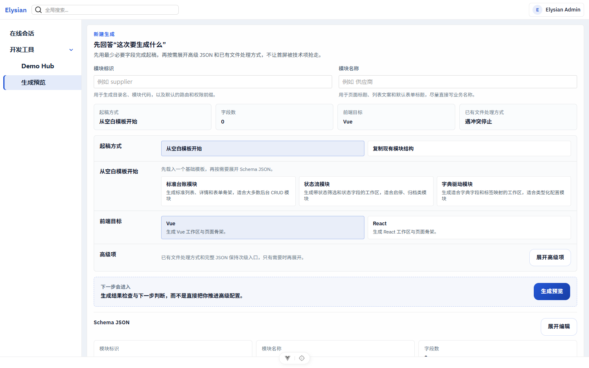
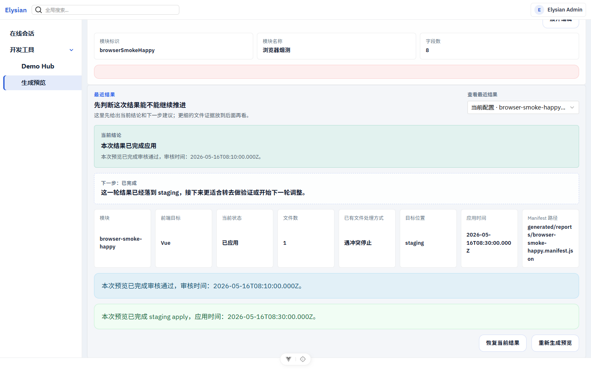
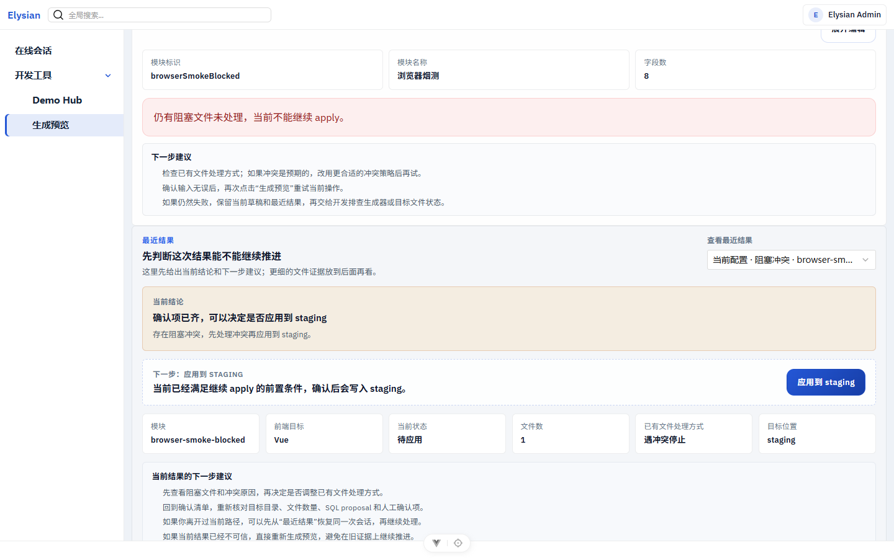

# Elysian

以代码生成为核心能力、面向中小项目交付的快速开发平台。输入结构化模块规格，生成可回收、可审查、可测试的前后端代码骨架，让团队把精力放回业务实现、权限边界和上线交付。

当前仓库已完成首个参考发行版 `v1.0.0` 的发布口径收口：

- 发布对象：`apps/example-vue` + `apps/server` + `packages/persistence` + `packages/generator`
- 发布说明：[docs/releases/v1.0.0.md](./docs/releases/v1.0.0.md)
- 默认前端：Vue 3 企业后台参考发行版
- 默认后端：Elysia + PostgreSQL + Docker 单主机生产基线

## 为什么选择 Elysian

| 特性 | 说明 |
|------|------|
| **结构化生成，不是低代码** | Schema 驱动生成生产级代码，可回收、可重构、可测试 |
| **前后端契约单一来源** | 一个 `ModuleSchema` 驱动后端 CRUD、前端页面、权限点、路由注册和数据库变更 |
| **AI 辅助，不削弱质量** | AI 生成 Schema，经校验网关后进入生成流程，人工兜底始终可用 |
| **企业能力内建** | RBAC、多租户（PostgreSQL RLS）、数据权限、审计日志，非事后拼接 |
| **前端可插拔** | UI 协议层与预设层分离，首发 Vue + TDesign，React / UniApp 保留扩展 |
| **生成闭环可审计** | Preview → Report → Staging Apply → 证据回放 |

## 项目截图



`generator preview` 工作区采用"新建生成 / 最近结果 / 生成结果"三段结构，让 schema 输入、历史结果和当前复核保持在同一条主流程里。



生成结果在 review / confirm 后只 apply 到 staging，并保留 report、manifest、request id 和 apply evidence。



当 apply 被阻断时，页面保留 blocker evidence 和下一步建议，便于 reviewer 判断后续操作。

## 技术栈

- **后端**：[Elysia](https://elysiajs.com/) (Bun) + PostgreSQL + Drizzle ORM
- **前端**：Vue 3 + Vite + TypeScript + TDesign Vue Next + Tailwind CSS
- **代码生成**：Schema 驱动 + 模板渲染 + 冲突策略 + manifest 追踪
- **部署**：Docker + docker-compose（单主机生产基线）

## 快速开始

### 前置条件

- [Bun](https://bun.sh) >= 1.3.10
- PostgreSQL（完整 CRUD 体验需要）
- Docker（容器启动需要）

### 容器一键启动

```bash
bun install
cp .env.example .env
bun run stack:up
```

服务默认监听 API `http://localhost:3000`，PostgreSQL `localhost:5432`。

### 本地双端口开发

```bash
bun install
cp .env.example .env        # 填入 DATABASE_URL / ACCESS_TOKEN_SECRET
bun run db:migrate
bun run db:seed
bun run dev:server          # 终端 1
bun run dev:vue             # 终端 2
```

默认 seed 创建超管账号 `admin / <ELYSIAN_ADMIN_PASSWORD>`。

## 代码生成器

```bash
# 从零初始化 schema 文件
bun --filter @elysian/generator generate --init supplier

# 预览生成结果（不写磁盘）
bun --filter @elysian/generator generate --schema-file ./supplier.module-schema.json \
  --target staging --frontend vue --preview

# 正式生成到 staging 目录
bun --filter @elysian/generator generate --schema-file ./supplier.module-schema.json \
  --out ./generated --frontend vue
```

最小 schema 示例：

```json
{
  "name": "supplier",
  "fields": [
    { "key": "name", "kind": "string", "required": true, "searchable": true },
    { "key": "status", "kind": "enum", "options": ["active", "inactive"] }
  ]
}
```

## 项目结构

```
apps/
  server/             # Elysia 服务端（API、鉴权、模块装配）
  example-vue/        # Vue 参考发行版
packages/
  core/               # 平台级共享基础能力
  schema/             # 结构化 Schema 定义与校验
  persistence/        # PostgreSQL + Drizzle ORM + 数据访问层
  generator/          # 代码生成器（模板渲染、冲突策略、manifest）
  frontend-vue/       # Vue 预设层（导航、权限、注册契约）
  ui-core/            # UI 协议层（框架无关的页面/表格/表单契约）
  ui-enterprise-vue/  # Vue 企业预设（TDesign 组件封装）
```

## 平台能力

### 后端模块

| 模块 | 说明 |
|------|------|
| 认证 | JWT + Refresh Session，登录/登出/刷新/在线会话管理 |
| RBAC | 用户、角色、权限、菜单，动态路由与权限指令 |
| 部门与岗位 | 树形组织结构、部门关联用户 |
| 字典与配置 | 字典类型/字典项 CRUD，key-value 系统配置 |
| 操作日志 | 审计日志查看、筛选、导出 |
| 文件管理 | 上传、下载、存储策略抽象 |
| 通知管理 | 站内通知、已读未读、批量操作 |
| 多租户 | PostgreSQL RLS 隔离，租户 CRUD 与一键初始化 |
| 数据权限 | 5 档数据范围（全部/自定义/本部门/本部门及下级/仅本人） |
| 工作流 | 简化流程引擎：定义、发起、线性审批、条件分支 |
| 代码生成会话 | Preview → Apply → Staging，可回放的生成闭环 |

### 前端组件

- **ElyShell** — 企业后台布局（侧边栏 + 顶栏 + 内容区 + 标签页）
- **ElyCrudWorkspace** — 标准 CRUD 工作区（列表 + 搜索 + 分页 + 空状态）
- **ElyContextPanel** — 侧滑面板（详情/编辑/创建/删除确认，含焦点陷阱与 Escape 关闭）
- **ElyTable / ElyForm / ElyQueryBar** — 企业级表格、表单、搜索栏
- **ElyPagination** — 分页组件（客户端/服务端模式，TDesign 风格）
- **13 个标准 CRUD 模块** — Schema 驱动注册，自动生成前端 surface

## 常用命令

| 命令 | 说明 |
|------|------|
| `bun run dev:server` | 服务端热更新 |
| `bun run dev:vue` | Vue 前端开发 |
| `bun run check` | lint + format + typecheck |
| `bun run test` | 单元测试 |
| `bun run build:vue` | 构建前端 |
| `bun run stack:up` | 容器一键启动 |
| `bun run stack:down` | 停止容器 |
| `bun run e2e:smoke:full` | E2E 冒烟测试 |
| `bun run e2e:tenant:full` | 多租户 E2E |

完整命令链见 [CONTRIBUTING.md](./CONTRIBUTING.md)。

## 文档索引

- [路线图](./docs/roadmap.md) — 活跃工作轨道与进展
- [v1.0.0 发布说明](./docs/releases/v1.0.0.md) — 首个参考发行版
- [发布检查清单](./docs/release-checklist.md) — 仓库发布与 go-live 检查项
- [架构边界](./docs/ARCHITECTURE_GUARDRAILS.md) — 模块职责与依赖约束
- [开发原则](./docs/DEVELOPMENT_PRINCIPLES.md) — 核心开发理念
- [产品定义](./docs/01-product-definition.md) — 产品目标与范围
- [架构草案](./docs/02-architecture.md) — 技术架构设计
- [AI 与代码生成策略](./docs/03-ai-codegen-strategy.md) — AI 辅助开发策略
- [整体实施规划](./docs/06-phased-implementation-plan.md) — 阶段划分与进度

## 核心原则

1. **企业上线优先于炫技** — 不做自研 SSR 元框架、低代码可视化搭建器
2. **约定优先于配置** — 默认行为覆盖 80% 场景，允许覆盖剩余 20%
3. **结构化生成优先于自由生成** — Schema 驱动，产出可回收、可重构
4. **前后端契约单一来源** — 一个 Schema 定义，多端生成
5. **AI 只放大工程效率，不削弱工程质量** — AI 产出经校验网关，人工兜底始终可用
6. **代码可回收、可重构、可测试** — 生成代码与手写代码同权
