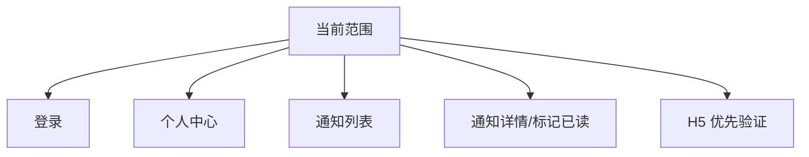
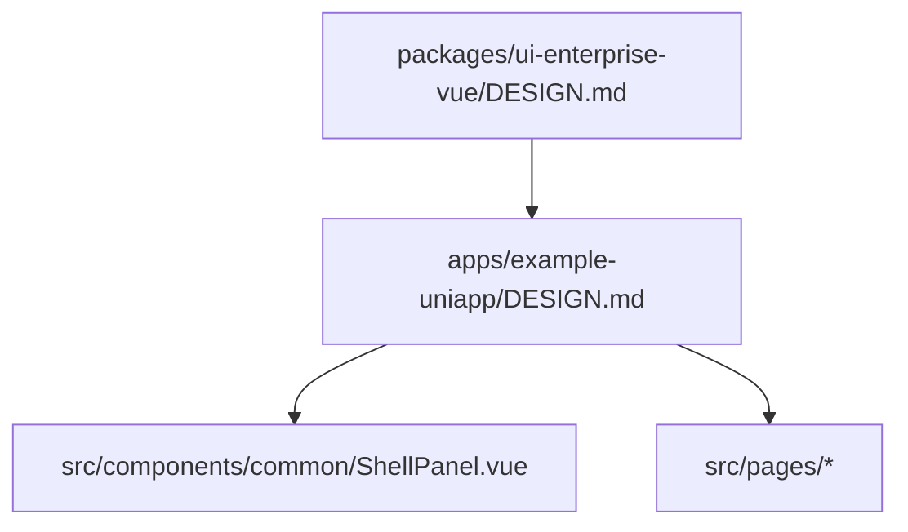

# `apps/example-uniapp`

`example-uniapp` 是第二界面方向的 app owner，但当前阶段仍是“可运行的第二界面骨架”。它只验证移动端最小闭环，不承担后台工作区或第二套平台前端职责。

## 应用职责

```mermaid
flowchart LR
    A[apps/example-uniapp] --> B[src/App.vue<br/>薄启动入口]
    B --> C[src/app<br/>bootstrap/session/routes]
    B --> D[src/pages<br/>login/home/notifications/detail]
    D --> E[src/lib/api|auth|notifications|storage]
    D --> F[src/components/common/ShellPanel.vue]
```

## Owns

- `uniapp` / H5 侧的最小应用入口与页面注册。
- 登录态恢复、当前用户身份读取、通知列表/详情/已读动作的本地接线。
- `uni.request` 风格的前端 API client、设备侧 session 快照与 app 内路由常量。

## Must Not Own

- 企业后台壳层、工作区切换、tabs、多模块后台路由。
- `packages/frontend-uniapp` 或跨端共享抽象 owner。
- 服务端 auth / notification 业务规则。
- 任何“uniapp 已成为并行主线”的叙述；当前仍是 Vue 主线之外的第二界面储备与验证。

## Depends On

- `@dcloudio/uni-app` 生态：页面生命周期、`uni.request`、页面路由。
- 现有服务端 contract：`/auth/login`、`/auth/refresh`、`/auth/me`、`/auth/logout`、`/system/notifications`。
- 本地 `src/lib/api/client.ts`：base URL、401 refresh、cookie/session 续期。

## 运行范围



- 这是移动端用户自助闭环，不是后台复刻。
- 当前页面与目录已经存在真实 auth/session/notifications 接线，因此不能再写成“纯占位”。
- 但范围依旧很窄：没有文件上传、复杂表单、workflow、后台管理。

## 设计约束继承



- 继续沿用企业预设的单主轴蓝色与克制容器语义。
- `uniapp` 可以比后台更轻，但不能漂移成第二套品牌系统。
- 默认文案必须保持产品化中文表达，不暴露“骨架/占位/demo only”。

## Key Flows

1. `App.vue` 只调用 `useAppBootstrap()`，由 `src/app/session/use-session-bootstrap.ts` 负责 refresh 恢复。
2. 登录页写入本地 session snapshot，并跳到个人中心。
3. 个人中心读取当前身份，并提供去通知列表和退出登录动作。
4. 通知列表按当前用户 `recipientUserId` 拉取站内通知；通知详情可执行“标记已读”。

## Validation

- 结构核对：`package.json`、`src/App.vue`、`src/app/*`、`src/pages.json`、`src/pages/*`、`src/lib/*`。
- 文档口径核对：`MODULE.md`、`DESIGN.md`、`docs/plans/2026-04-28-uniapp-scope-plan.md`、`docs/plans/2026-04-28-uniapp-p1-scaffold-draft.md`。
- 运行时建议：
  - `bun run dev:uniapp`
  - 仅验证 `login -> home -> notifications -> notification-detail` 最小链路，不把它当成后台应用验收。

