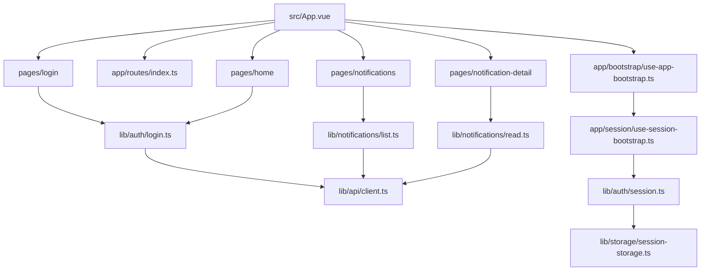
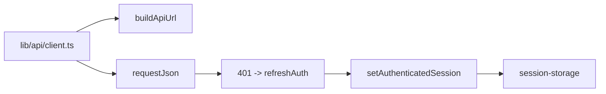
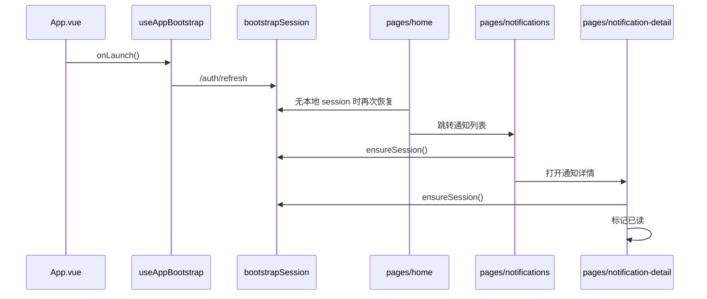

# `apps/example-uniapp/src`

本目录是 `example-uniapp` 的实现边界。它按 `pages / app / lib / components` 四层收口，只服务当前的第二界面最小闭环。

## 目录边界



## Owns

- `App.vue`：薄启动入口，只负责应用级 bootstrap。
- `app/`：session 恢复、路由常量、启动编排。
- `pages/`：页面级用户流程和展示状态。
- `lib/`：uniapp 侧 API client、auth/session、notifications、设备存储。
- `components/common/ShellPanel.vue`：当前 app 内统一面板语义。

## Must Not Own

- 企业后台工作区和多模块管理壳层。
- 跨端共享状态库或 `packages/frontend-uniapp`。
- 服务端 DTO canonical owner、通知/鉴权业务规则。
- 与当前范围无关的推送、地图、支付、IM、原生桥接。

## Depends On

- `uni.request` 与 `@dcloudio/uni-app` 生命周期。
- 服务端 auth / notifications contract。
- 本地 session 快照：`lib/auth/session.ts` + `lib/storage/session-storage.ts`。

## API Client 边界



- `lib/api/client.ts` 是 uniapp 侧 request owner。
- 它可以拥有 base URL 正规化、cookie/request 配置和 401 后 refresh。
- 它不应演变成跨 Vue/uniapp 共享 client。

## Shell / 页面流



## 设计约束继承

```mermaid
flowchart TD
    A[packages/ui-enterprise-vue/DESIGN.md] --> B[apps/example-uniapp/DESIGN.md]
    B --> C[ShellPanel]
    B --> D[pages/login|home|notifications|notification-detail]
```

## Key Flows

1. 启动时先做 refresh 恢复；失败则清理本地快照，不伪造登录态。
2. 首页既是个人中心，也是“会话有效性 + 去通知页”的最小导航页。
3. 通知列表通过 `recipientUserId` 读取当前用户站内通知。
4. 通知详情读取单条通知，并在本页完成“标记已读”。

## Validation

- 核对 `src/pages.json` 是否仍只声明 `login / home / notifications / notification-detail` 四个页面。
- 核对 `src/app/*` 是否继续保持薄装配，不把业务请求塞入 `App.vue`。
- 运行时建议：
  - `bun run dev:uniapp`
  - 手工走一遍登录恢复、个人中心、通知列表、通知详情/已读链路。

