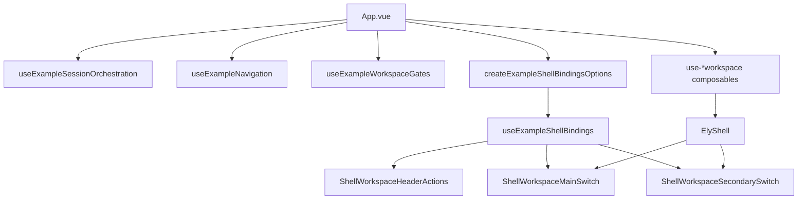
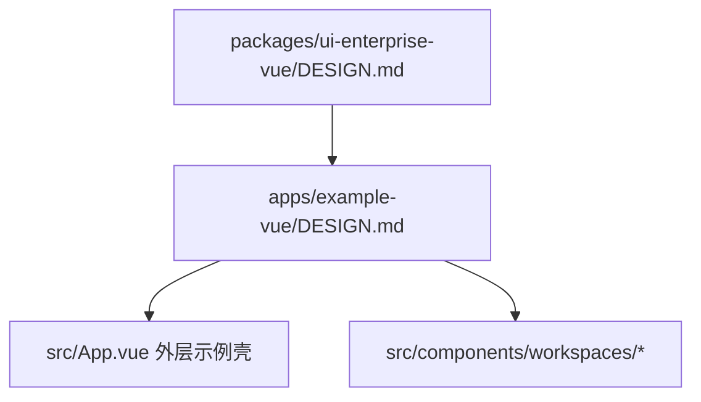

# `apps/example-vue`

`example-vue` 是当前仓库的企业预设前端主验证面，但它的定位仍然是“企业预设 + 多工作区联调验证页”，不是完整后台平台，也不是第二个 shared owner。

## 应用职责

```mermaid
flowchart LR
    A[apps/example-vue] --> B[src/App.vue<br/>单入口装配]
    B --> C[src/app<br/>shell 导航/权限/session 绑定]
    B --> D[src/workspaces<br/>单工作区状态与动作]
    D --> E[src/lib/platform-api*<br/>app 内 API client]
    D --> F[src/lib/*-workspace.ts<br/>查询/选择/表单派生]
    B --> G[src/components/workspaces<br/>展示组件]
    B --> H[@elysian/ui-enterprise-vue]
    B --> I[@elysian/frontend-vue]
    B --> J[@elysian/schema]
```

## Owns

- 企业预设在真实业务模块上的接线样例，包括 `customers`、系统模块、`workflow` 与 `generator preview` 的工作区验证。
- `ElyShell` 的应用级装配：动态菜单、本地 fallback/studio 导航补充、shell tabs、工作区切换。
- 登录态恢复、权限 gate、模块 ready 状态与各工作区 reload 编排。
- app 内 API client 入口：`src/lib/platform-api.ts` 及 `src/lib/platform-api/*`。

## Must Not Own

- 服务端鉴权规则、DTO canonical owner、数据库语义、菜单 seed 规则。
- 第二套企业预设组件体系；共享视觉与交互基线仍归 `@elysian/ui-enterprise-vue`。
- 完整后台平台叙事；当前没有通用 page registry / route registry owner，不应把本应用写成已完成的平台主前端。
- `uniapp`、React 或其他端的共享抽象层。

## Depends On

- `@elysian/ui-enterprise-vue`：共享 shell、CRUD workspace 和企业预设组件。
- `@elysian/frontend-vue`：schema 到 Vue 页面/导航的适配能力。
- `@elysian/schema`：模块 schema 与部分稳定类型。
- `src/lib/platform-api/core.ts`：base URL、Bearer token、401 后 refresh 重试。
- `src/lib/platform-api/*`：按领域拆开的 endpoint wrapper；根 `platform-api.ts` 同时充当 app 内 barrel 和 DTO 汇总入口。

## Shell / Workspace 装配



- `App.vue` 仍是唯一装配入口。
- `src/app` 负责把导航、权限、session、shell props/listeners 组合成 `ElyShell` 可消费的输入。
- `src/workspaces` 负责每个工作区的本地状态、查询、表单、动作、reload 和错误处理。
- `src/components/workspaces` 只负责壳层切换和具体工作区展示，不直接持有 API client。

## API Client 边界

```mermaid
flowchart LR
    A[src/lib/platform-api/core.ts] --> B[requestJson / requestBlob]
    B --> C[/auth/refresh 自动重试]
    A --> D[src/lib/platform-api/auth.ts]
    A --> E[src/lib/platform-api/customer.ts]
    A --> F[src/lib/platform-api/users.ts 等领域文件]
    D --> G[src/workspaces/use-auth-session-workspace.ts]
    E --> H[src/workspaces/use-customer-workspace.ts]
    F --> I[其它工作区 composables]
```

- 这是 `example-vue` 自己的前端 API owner，不是共享 schema owner。
- 可以拥有前端请求细节、token 恢复和 app 侧错误映射。
- 不应反向承接服务端业务规则，也不应被写成跨端共享包。

## 设计约束继承



- 共享企业预设提供主视觉基线。
- `apps/example-vue/DESIGN.md` 只允许“示例壳”级差异，不能重定义第二套后台语言。
- 第一视觉焦点必须始终是可运行工作区，而不是说明面板。

## Key Flows

1. 启动时 `useExampleSessionOrchestration` 拉取 `/platform` 与 `/system/modules`，计算模块 ready 状态，再尝试 `refreshAuth()` 恢复登录态。
2. 登录成功后按工作区依次 reload，导航由服务端菜单 + 本地 fallback/studio/session 补充构成。
3. 当前选中菜单驱动 `currentWorkspaceKind`，再由 shell binding 把对应工作区主区/侧区渲染到 `ElyShell`。
4. 各领域 API 请求通过 `src/lib/platform-api/*` 发出，工作区只消费 app 内 DTO 和动作函数。

## Validation

- 结构核对：`package.json`、`src/App.vue`、`src/app/*`、`src/workspaces/*`、`src/lib/platform-api*`。
- 文档口径核对：`MODULE.md`、`DESIGN.md`、`docs/roadmap.md` 与 `docs/plans/2026-04-26-vue-enterprise-example-boundaries-and-benchmark.md`。
- 运行时建议：
  - `bun run dev:vue`
  - 登录后切换 `customers / system-* / workflow / generator preview`，确认 shell 与工作区仍按当前边界组织。

