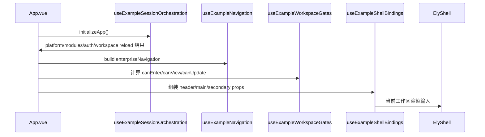
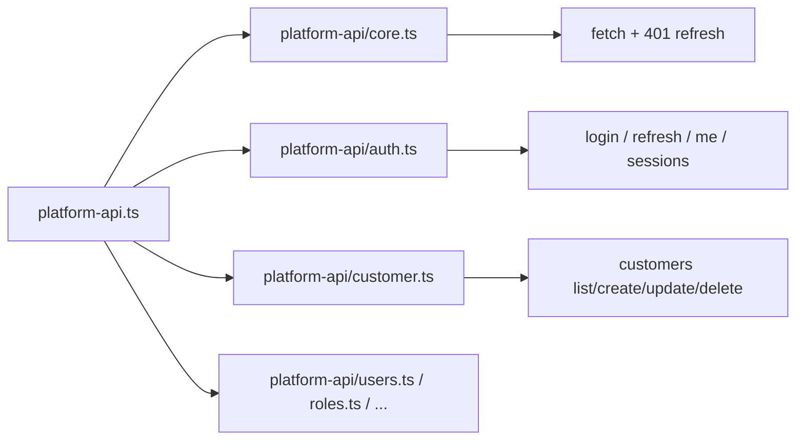
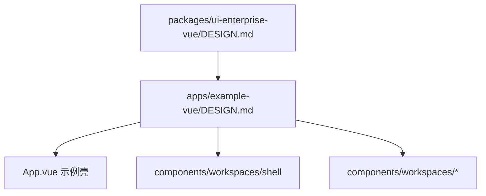

# `apps/example-vue/src`

本目录是 `example-vue` 的应用装配 owner。它把共享企业预设、app 内 API client 和多个本地工作区收口到一个可验证的示例前端里。

## 边界总览

```mermaid
flowchart TD
    A[src/App.vue] --> B[src/app]
    A --> C[src/workspaces]
    A --> D[src/components/workspaces]
    C --> E[src/lib/*-workspace.ts]
    C --> F[src/lib/platform-api.ts]
    F --> G[src/lib/platform-api/*]
    A --> H[@elysian/ui-enterprise-vue]
    A --> I[@elysian/frontend-vue]
```

## Owns

- `App.vue` 单入口装配：locale runtime、shell manifest、工作区实例化与 `ElyShell` 集成。
- `src/app/*`：导航构建、workspace gate、query summary、session orchestration、shell binding 聚合。
- `src/workspaces/*`：按领域拆开的本地状态机与 UI 动作编排。
- `src/lib/platform-api.ts` 与 `src/lib/platform-api/*`：app 内 API 请求封装与前端 DTO 入口。
- `src/lib/*-workspace.ts`：领域工作区的查询参数、选择规则、默认 draft、展示转换。

## Must Not Own

- `packages/*` 的共享协议、schema 或企业预设实现。
- 服务端模块注册、权限点生成、菜单 canonical owner。
- 通用跨端 shared utils 桶文件；这里的 helper 仅服务当前 app。
- 任何“完整后台已经实现”的叙述。当前是多工作区联调验证面，不是完整平台前端。

## Depends On

- `@elysian/ui-enterprise-vue`：`ElyShell`、`ElyCrudWorkspace`、`useElyCrudPage`。
- `@elysian/frontend-vue`：schema 页面 contract、导航构建、字典选项映射、locale runtime。
- `@elysian/schema`：模块 schema 与稳定 record 类型。
- `tdesign-vue-next`：当前企业预设运行时底座。

## 目录职责

### `App.vue`

- Owns：
  - 应用顶层状态、locale、shell 装配、各工作区实例与最终模板渲染。
- Must Not Own：
  - 具体领域 API 细节、通用展示组件实现、跨端共享逻辑。

### `app/`

- Owns：
  - `useExampleSessionOrchestration.ts`：启动、登录、退出、模块 ready 与批量 reload。
  - `useExampleNavigation.ts`：服务端菜单 + fallback/studio/session 导航拼装。
  - `useExampleShellBindings.ts` 及相关 binding 文件：把工作区数据拼成 header/main/secondary 的 props/listeners。
- Must Not Own：
  - 领域 CRUD 规则和展示层细节。

### `workspaces/`

- Owns：
  - 单工作区状态、列表/表单/详情动作、与 `lib/platform-api` 的直接协作。
- Must Not Own：
  - 企业 shell、本地路由框架、跨工作区共享 owner。

### `lib/platform-api*`

- Owns：
  - base URL、token、401 refresh 重试、按领域拆分的 endpoint wrapper、app 内 DTO 汇总入口。
- Must Not Own：
  - 服务端 auth 规则和共享 schema owner。

## Shell / Workspace 装配



## API Client 边界



- `platform-api.ts` 当前同时承担 barrel 与部分 DTO 汇总，这是 app 内组织事实。
- 真正的请求底层在 `platform-api/core.ts`，它负责 Bearer token 和记忆态 refresh。
- 领域工作区直接依赖 `platform-api` 与本地 `*-workspace.ts` helper；不穿透到 `packages/*` 去拿运行时请求实现。

## 设计约束继承



## Key Flows

1. 启动：读取平台 manifest 与模块列表，决定哪些工作区 ready。
2. 会话：`refreshAuth()` 恢复登录态；失败时只清理 app 侧 token 与工作区状态。
3. 导航：服务端菜单转企业导航，本地再补 session/studio/fallback 项。
4. 工作区：`src/workspaces/*` 调用 `src/lib/platform-api/*`，把结果映射给 `components/workspaces/*`。

## Validation

- 人工核对 `App.vue` 的 imports、`src/app/*` 命名和 `src/workspaces/*` / `src/lib/platform-api/*` 的依赖方向。
- 运行时建议：
  - `bun run dev:vue`
  - 登录后检查菜单切换、会话恢复、单工作区 CRUD/详情/列表是否仍由本目录完成装配。

