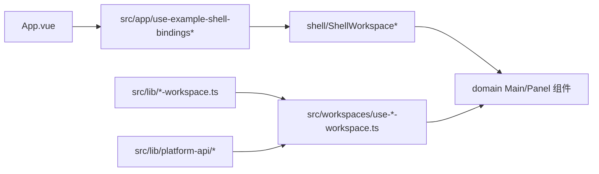
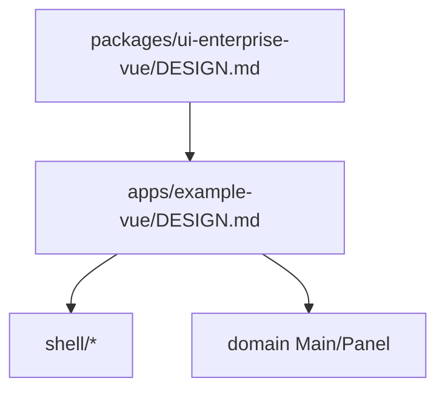

# `apps/example-vue/src/components/workspaces`

本目录是 `example-vue` 的工作区展示层 owner。它只负责“怎么显示当前工作区”，不负责“怎么请求和保存数据”。

## 目录形状

```mermaid
flowchart TD
    A[components/workspaces] --> B[shell/]
    A --> C[customer|user|role|...]
    A --> D[generator/]
    A --> E[workflow/]
    B --> B1[ShellWorkspace* 切换组件]
    C --> C1[*WorkspaceMain.vue]
    C --> C2[*WorkspacePanel.vue]
```

## Owns

- `shell/`：`ShellWorkspaceHeaderActions`、`ShellWorkspaceMainSwitch`、`ShellWorkspaceSecondarySwitch` 等壳层展示与切换组件。
- 各领域目录的 `*WorkspaceMain.vue` / `*WorkspacePanel.vue`：主区和侧区的具体呈现。
- 与展示直接相关的轻量类型文件，例如 `generator/types.ts`、`workflow/types.ts`。

## Must Not Own

- API 请求、token 刷新、401 恢复、session bootstrap。
- 领域查询条件构造、选择回退规则、默认表单 draft。
- 跨工作区共享业务 helper；这些逻辑应留在 `src/workspaces/*` 或 `src/lib/*-workspace.ts`。

## Depends On

- `src/app/use-example-shell-bindings*`：决定当前要渲染哪个 main/panel/header。
- `src/workspaces/*`：提供 props、事件处理器、状态与动作。
- `@elysian/ui-enterprise-vue`：标准企业预设组件 contract。

## 展示层与状态层关系



- `src/workspaces/*` 负责把领域状态整理成组件可消费输入。
- 本目录组件消费这些输入并抛出 UI 事件。
- 领域组件不应直接 import `platform-api`。

## 设计约束继承



- 外层示例壳允许存在导览式表达，但不能压过工作区主体。
- 同一工作区的 main/panel 应复用企业预设的蓝色体系、圆角和容器语义。
- 本目录不重新定义第二套视觉 token。

## Key Flows

1. `App.vue` 通过 shell binding 决定当前 header/main/secondary 的组件和 props。
2. `ShellWorkspaceMainSwitch` / `ShellWorkspaceSecondarySwitch` 只负责切换到对应领域组件。
3. 领域组件根据 `src/workspaces/*` 传入的状态渲染列表、表单、详情或空态。
4. 用户交互事件再回流到 `src/workspaces/*`，由后者决定是否调用 `src/lib/platform-api/*`。

## Validation

- 检查每个领域目录是否仍维持 `Main/Panel` 分工，不把 fetch 和状态逻辑塞回组件。
- 运行时建议：
  - `bun run dev:vue`
  - 在 shell 中切换多个工作区，确认主区/侧区切换不依赖组件内部私有请求逻辑。

