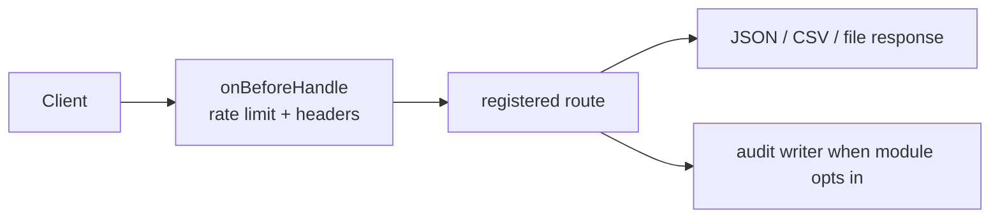

# apps/server

`apps/server` 是后端运行时 owner，负责把 HTTP、鉴权、租户上下文、模块注册和错误/观测基线装配成一个可运行服务。

> 当前简化边界：除 `system` 外，业务模块只在存在 `DATABASE_URL` 时注册；运行时默认基于 `Elysia + @elysian/persistence`，不声明独立发布平台、对象存储或通用 BPM 引擎已经成熟。

## Owns

- `createServerApp()` 的 HTTP 装配、CORS、OpenAPI、统一错误 envelope、内存限流响应头。
- `registerModules()` 的模块注册协议和失败包装。
- `system` 模块的健康检查、平台清单、运行时指标和已注册模块视图。
- `index.ts` 中的显式模块装配顺序，包括 `tenant-context -> auth -> business modules`。
- 服务端运行时级的日志、配置读取和错误映射。

## Must Not Own

- `packages/persistence` 的表结构、关系型 schema 和迁移策略。
- `packages/schema` 的模块契约定义。
- 前端页面实现、前端状态、前端权限 gate 细节。
- 生成器模板逻辑和 schema-first 代码生成规则。

## Depends On

- `@elysian/persistence`：数据库 client、tenant context、各模块持久化 helper。
- `@elysian/schema`：模块 schema 名称、字段契约、workflow 草稿校验。
- `@elysian/core`：平台 manifest。
- `src/modules/*`：HTTP 路由、应用层 service、repository 桥接。

## Key Flows

```mermaid
flowchart LR
  A[index.ts] --> B[createServerApp]
  B --> C[registerModules]
  C --> D[system]
  C --> E[tenant-context]
  C --> F[auth]
  C --> G[customer / file / workflow / ...]
  G --> H[@elysian/persistence]
  F --> H
  E --> H
```

```mermaid
flowchart TD
  Req[HTTP request] --> Tenant[tenant-context\nset/reset tenant context]
  Tenant --> Auth[auth guard / route auth]
  Auth --> Module[module.ts]
  Module --> Service[service.ts]
  Service --> Repo[repository.ts]
  Repo --> DB[@elysian/persistence]
  Service --> Err[AppError]
  Err --> Envelope[toErrorResponse]
```



- `system` 总是注册；其余模块在 `index.ts` 里按显式顺序装配，而不是目录扫描。
- `tenant-context` 先根据 access token 或 refresh cookie 推导 `tenantId`，再为请求设置数据库上下文。
- `auth` 负责 identity、refresh session、权限校验和审计；其他模块只消费 `AuthGuard` / `AuthIdentity`。
- `generator-session` 和 `workflow` 的审计写入是 best-effort，不阻断业务成功结果。

## Validation

- `src/app.ts` 已确认统一拥有 CORS、OpenAPI、rate limit、404 与异常错误映射。
- `src/index.ts` 已确认模块注册是显式装配，且 `DATABASE_URL` 缺失时不会注册业务模块。
- `src/modules/module.ts` 已确认模块边界契约仅包含 `name + register(app, context)`。
- `src/modules/system.ts` 已确认 `/health`、`/platform`、`/metrics`、`/metrics/prometheus`、`/system/modules` 属于 server runtime owner。
