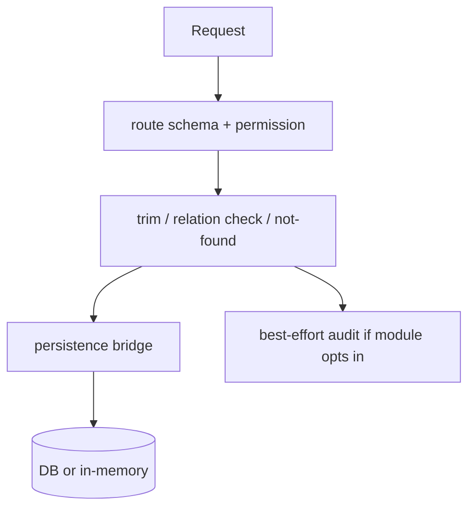

# apps/server/src/modules

这里是 `apps/server` 的模块层：每个目录负责一个后端运行时边界，通常由 `module.ts + service.ts + repository.ts + index.ts` 组成。

> 当前简化边界：模块层强调“单模块闭环 + 显式装配”，不是自动发现框架，也不是通用 DDD 平台；`system`、`module.ts` 和 `tenant-context` 属于模块层配套设施，但不各自拥有独立目录。

## Owns

- 每个模块的 HTTP 路由注册、请求 DTO、权限检查入口。
- 模块级 service 校验、错误语义和最小业务编排。
- repository 对 `@elysian/persistence` 的本地桥接，以及 in-memory 替身。
- 模块导出面：`createXModule`、`createXRepository`、`createInMemoryXRepository`。

## Must Not Own

- 跨模块共享 schema、共享数据库 owner、共享前端契约。
- 独立的基础设施扫描器、隐式 IoC 容器或自动注册机制。
- 绕过 `auth` / `tenant-context` 直接在模块里重做鉴权或租户隔离。

## Depends On

- `./module.ts`：统一 `ServerModule` 注册协议。
- `../auth`：权限校验、identity、数据范围。
- `@elysian/persistence`：真实持久化 helper。
- `@elysian/schema`：模块名、字段契约、部分运行时校验（如 workflow draft）。

## 模块分组

- 平台接入：`auth`、内部 `tenant-context`、`tenant`。
- 主数据/系统管理：`user`、`role`、`menu`、`department`、`post`、`dictionary`、`setting`。
- 业务/内容：`customer`、`file`、`notification`、`operation-log`。
- Studio / 编排：`generator-session`、`workflow`。

## Key Flows

```mermaid
flowchart LR
  M[module.ts] --> S[service.ts]
  S --> R[repository.ts]
  R --> P[@elysian/persistence]
  M --> A[auth guard]
  A --> Auth[auth service]
```



- `auth` 输出 identity、permissionCodes、menus、dataAccess，其他模块只消费结果，不反向拥有鉴权规则。
- `customer`、`file`、`notification` 会消费 `dataAccess` 做部门/创建人范围过滤。
- `tenant` repository 会主动清理请求级 tenant context，以支持 super-admin 跨租户管理。
- `workflow` 和 `generator-session` 明确处于“已验证的简化运行态”，不要把它们当成通用平台能力。

## Validation

- `index.ts` 已确认每个模块的导出入口都保持显式，不依赖目录扫描。
- 各模块的 `repository.ts` 已确认同时提供真实数据库桥接和 in-memory 替身，验证边界清晰。
- `module.ts` 已确认权限点和路由仍在 server owner 内，没有下沉到 `packages/persistence`。
