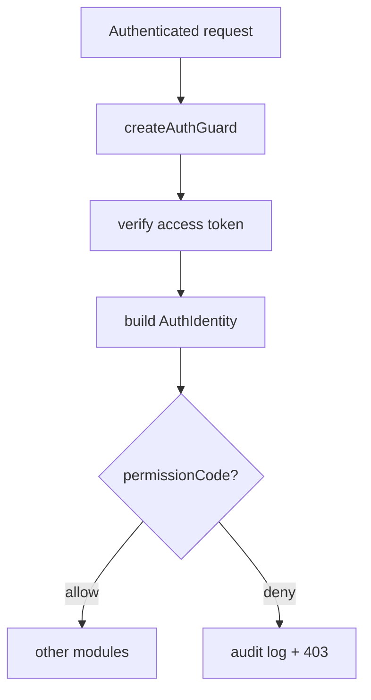

# auth

`auth` 是后端鉴权 owner，负责登录、refresh session、当前身份、会话管理和权限校验入口。

> 当前简化边界：当前只覆盖用户名密码登录、短 access token、可轮换 refresh session、最小审计与租户推导；未实现 MFA、登录锁定策略、设备指纹或外部 IdP。

## Owns

- `POST /auth/login`、`POST /auth/refresh`、`POST /auth/logout`、`GET /auth/me`、`GET /auth/sessions`、`DELETE /auth/sessions/:id`。
- `AuthIdentity`、`AuthLoginResponse`、`AuthGuard` 的 canonical 形状。
- access token 签发/校验、refresh token 轮换、refresh cookie 读写。
- 登录、refresh、logout、permission denied、session revoke 的最小审计写入。
- `tenant-context` 内部模块：为请求设置/重置数据库 tenant context。

## Must Not Own

- 用户/角色/菜单的后台 CRUD 工作区。
- 持久化 schema、refresh session 表结构 owner。
- 登录失败锁定、MFA、外部 SSO 等未落地能力。

## Depends On

- `@elysian/persistence`：用户、角色、权限、菜单、refresh session、audit log、tenant context helper。
- `password.ts`：密码 hash 校验。
- `tokens.ts`：access token / refresh token 生成与校验。
- `tenant.ts`：请求级 tenant context module。

## Key Flows

```mermaid
flowchart LR
  A[POST /auth/login] --> B[module.ts]
  B --> C[service.login]
  C --> D[AuthRepository]
  D --> E[@elysian/persistence]
  C --> F[sign access token]
  C --> G[create refresh session]
  B --> H[HttpOnly refresh cookie]
```



## Validation

- `module.ts` 已确认 `/auth/me` 与 `/auth/sessions` 需要 Bearer token；`/auth/refresh` 与 `/auth/logout` 依赖 refresh cookie。
- `service.ts` 已确认登录成功会更新 `lastLoginAt`，refresh 会创建新 session 并 revoke 旧 session。
- `service.ts` 已确认 `AuthIdentity` 统一输出 `user / deptIds / dataScopes / dataAccess / roles / permissionCodes / menus`。
- `guard.ts` 已确认其他模块只通过 `AuthGuard.authorize(headers, permissionCode?)` 消费鉴权结果。
- `tenant.ts` 已确认请求 tenant context 先读 access token 的 `tid`，否则退回 refresh cookie 中的 tenant 信息。
