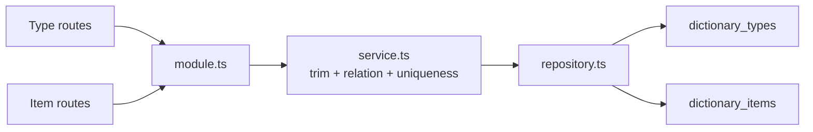

# dictionary

`dictionary` 负责字典类型与字典项的管理接口，是系统静态配置数据的后台 owner。

## Owns

- `/system/dictionaries/types` 与 `/system/dictionaries/items` 的列表、详情、创建、更新。
- 字典类型 `code/name` 校验和项级 `typeId/value/label` 校验。
- “同一类型下 value 唯一”的最小规则。

## Must Not Own

- 业务表单如何消费字典的前端联动逻辑。
- 运行时缓存、分布式字典下发、外部字典源同步。
- 通用配置中心能力。

## Depends On

- `../auth`：权限点 `system:dictionary:list/create/update`。
- `@elysian/persistence`：dictionary types/items helper。
- `@elysian/schema`：字典记录契约。

## Key Flows

## Validation

- `service.ts` 已确认 type `code/name`、item `typeId/value/label` 都会先 trim 再校验非空。
- `service.ts` 已确认 item 写入前必须先确认 type 存在，否则返回 `DICTIONARY_ITEM_TYPE_INVALID`。
- `service.ts` 已确认 item 的 `(typeId, value)` 冲突会被显式拦截。
