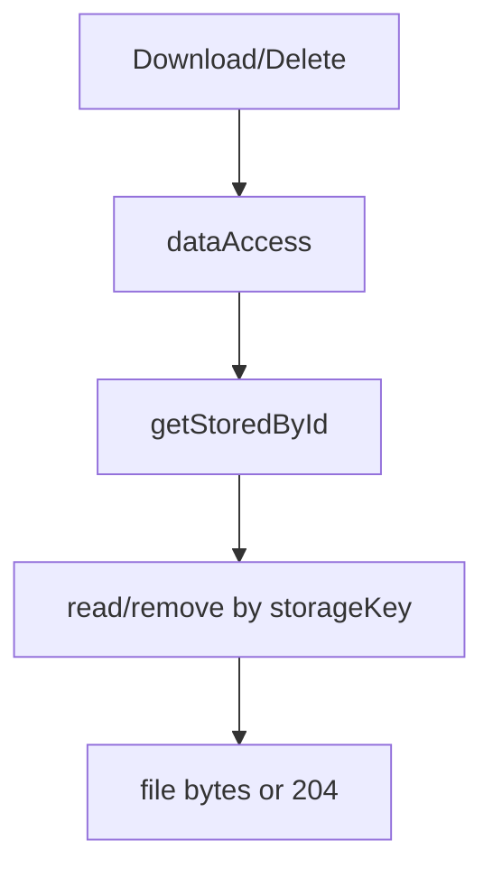

# file

`file` 负责文件元数据接口和二进制存储适配器的运行时装配，明确把 metadata owner 与 binary storage owner 分开。

> 当前简化边界：当前只验证本地磁盘与 in-memory 存储；未实现对象存储、多副本、预览/缩略图、生命周期清理。

## Owns

- `/system/files` 的列表、详情、上传、下载、删除。
- 上传时的 multipart `file` 校验。
- 二进制存储适配器 `FileStorage` 的 server runtime owner。
- 元数据与文件内容的双阶段处理：先存内容，再写元数据；删除时先删内容，再删元数据。

## Must Not Own

- `files` 表 schema owner。
- 对象存储 SDK、CDN、预签名 URL 等未来能力的事实化表述。
- 通用内容管理系统语义。

## Depends On

- `../auth`：权限点 `system:file:list/upload/download/delete` 与 `dataAccess`。
- `@elysian/persistence`：files helper、data access condition。
- `storage.ts`：本地磁盘 / in-memory 文件存储。

## Key Flows

```mermaid
flowchart LR
  A[POST /system/files] --> B[module.ts\nmultipart check]
  B --> C[service.upload]
  C --> D[FileStorage.save]
  C --> E[FileRepository.create]
  E --> F[@elysian/persistence\nfiles]
```



## Validation

- `module.ts` 已确认上传接口从 `formData.get("file")` 取文件，缺失时返回 `FILE_UPLOAD_REQUIRED`。
- `service.ts` 已确认下载和删除都基于 `getStoredById`，先做 metadata + dataAccess 判定，再触达存储层。
- `storage.ts` 已确认默认落点是 `process.cwd()/.elysian/uploads`，内容缺失会返回 `FILE_CONTENT_NOT_FOUND`。
