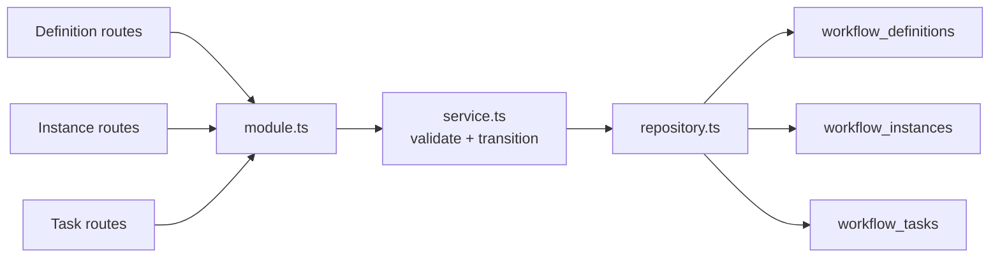
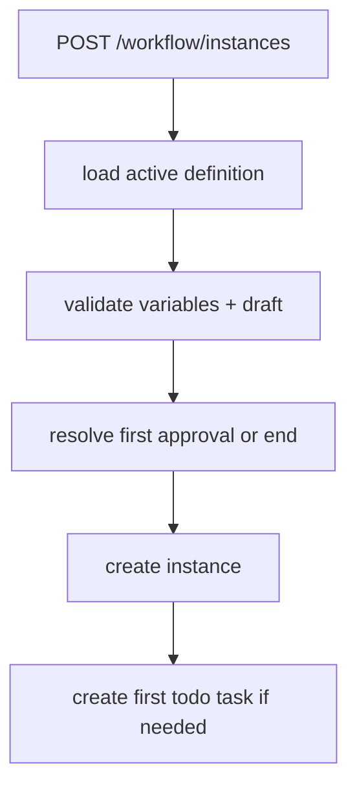
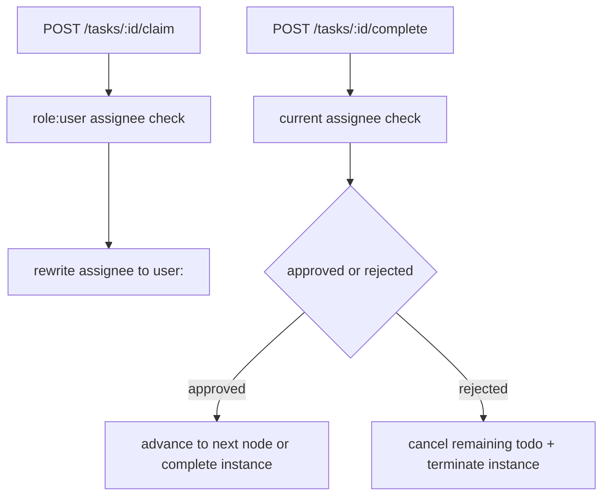

# workflow

`workflow` 负责当前最小可运行的流程定义、实例和任务闭环，是一个已验证的简化运行态。

> 当前简化边界：当前运行时只支持简化审批流、线性节点推进和白名单条件分支；支持 `claim`、`complete(approved/rejected)`、`cancel`，但不宣称支持 `transfer`、`delegate`、复杂并行、循环或通用 BPM。

## Owns

- `/workflow/definitions`、`/workflow/instances`、`/workflow/tasks/*` 全部当前路由。
- definition 草稿校验、definition version 递增创建。
- instance start、todo/done 查询、task claim、task complete、instance cancel。
- workflow 成功路径的 best-effort 审计写入。

## Must Not Own

- 通用 BPM 平台、复杂任务语义、图形设计器。
- 持久化 schema owner。
- 前端流程编辑器或报表工作区。

## Depends On

- `../auth`：workflow 三组权限点加独立 `workflow:task:claim`。
- `@elysian/schema`：workflow draft 校验、条件表达式解析。
- `@elysian/persistence`：definitions、instances、tasks helper。

## Key Flows

## Validation

- `module.ts` 已确认 definition、instance、task 使用独立权限点，而不是复用单一 workflow 权限。
- `service.ts` 已确认 definition 更新不是原地修改，而是按同 `key` 新建新版本。
- `service.ts` 已确认 claim 只允许匹配当前角色的 `role:<code>` assignee，claim 后改写为 `user:<id>`。
- `service.ts` 已确认 runtime 不支持多分支随意出边、循环和复杂结构，命中时会返回 `WORKFLOW_DEFINITION_RUNTIME_UNSUPPORTED`。
- `repository.ts` 已确认 instances/tasks 都按 `tenantId` 做隔离，claim history 也会持久化。
