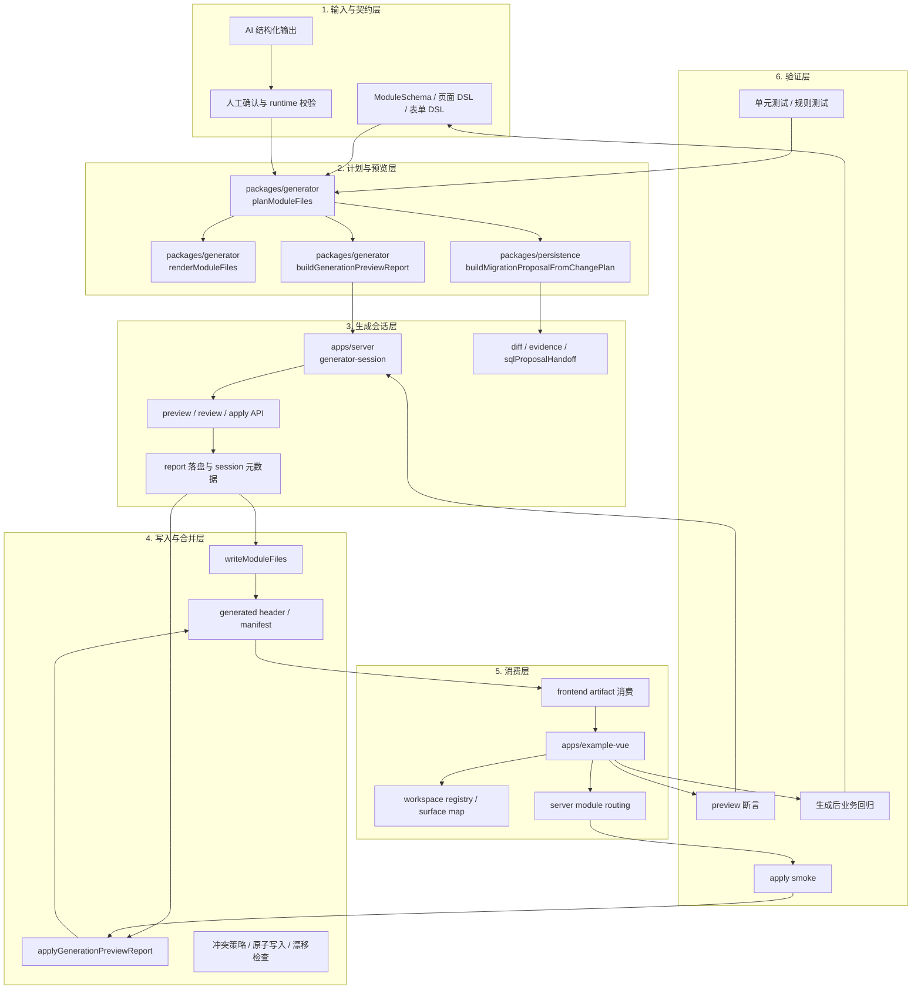

# AI 与代码生成策略

## 总原则

AI 负责提速，代码生成负责收敛，工程规则负责兜底。

如果 AI 直接输出大段最终代码，随着项目复杂度增长，结果会迅速失控。首版必须采用“结构化中间层”策略。

## 推荐链路

```text
业务意图
  -> AI 生成结构化规格
  -> 人工确认 / 自动校验
  -> generator 生成代码
  -> 测试与 lint 校验
  -> 进入业务迭代
```

## 自举闭环分层

generator 的目标不是单次生成，而是形成可重复、可审计、可回放的自举闭环。这里的“自举”指的是：结构化 schema 作为唯一输入，生成预览、合并、落盘、消费和验证都围绕同一套产物契约展开。



### 分层说明

- 输入与契约层只负责把需求收敛为结构化 schema，不直接输出最终代码。
- 计划与预览层负责把 schema 变成文件计划、预览报告和 SQL proposal，重点是可解释而不是可执行。
- 生成会话层负责把 preview、review、apply 串成可查询的运行时会话，保留回放和证据。
- 写入与合并层负责真正落盘，但必须先经过冲突策略、漂移检查和 manifest 生成。
- 消费层负责让生成结果进入真实工程，不再停留在预览态。
- 验证层负责把生成结果重新变成下一轮输入条件，形成闭环。

### 自举顺序

1. 先固定 `schema -> preview/report` 的输出契约。
2. 再固定 `preview -> review -> apply` 的会话流程。
3. 再固定 `apply -> manifest -> frontend artifact -> 正式模块` 的落地路径。
4. 最后用生成后的模块回测 generator 自身，验证重复生成、冲突处理和证据回放是否稳定。

## AI 的职责

- 把自然语言需求转成实体、字段、页面、权限、流程的结构化描述
- 基于现有模块补全查询条件、表单项、文案、测试样例
- 生成迁移建议、模块变更说明、接口注释、测试草案
- 作为平台内辅助工具，加速已有模块的维护

## AI 不应承担的职责

- 直接生成不可验证的完整项目
- 越过 schema 和模板直接篡改核心基础设施
- 在没有审计和回放的情况下批量改代码

## 中间表示建议

至少定义以下几类 schema：

- `entity.schema.json`
- `page.schema.json`
- `form.schema.json`
- `table.schema.json`
- `permission.schema.json`
- `module.schema.json`

AI 输出必须满足这些 schema 约束，才能进入生成环节。

## 代码生成策略

### 生成优先

适用于：

- 标准 CRUD 模块
- 列表页、详情页、编辑页
- API 路由
- DTO / 校验
- 菜单注册
- 权限点声明

### 合并优先

适用于：

- 已存在业务模块上的新增字段
- 页面局部增改
- 权限与菜单扩展

### 人工优先

适用于：

- 复杂业务流程
- 高耦合领域逻辑
- 聚合规则和事务边界
- 高风险改动

## 企业级约束

要避免“生成出来能看不能改”，必须保证：

- 每个生成文件都可重新生成
- 每个可手改区域都有明确边界
- 生成记录可追踪
- AI 输入输出可回放
- 模板版本可追踪

## 推荐实现顺序

1. 先做 schema 驱动的纯代码生成
2. 再接入 AI 生成 schema
3. 最后再做平台内交互式 AI 助手
