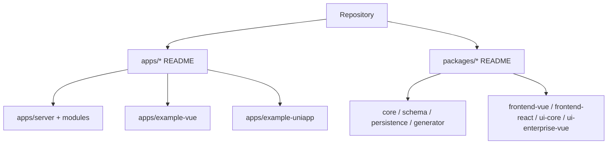
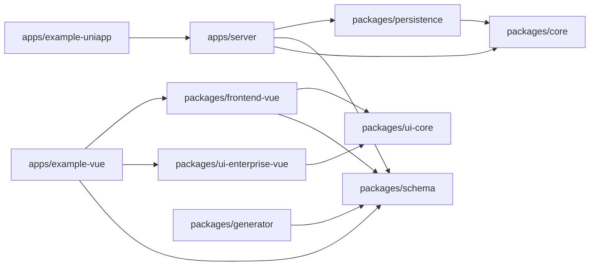
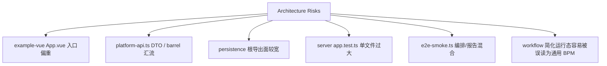

# 2026-04-29 系统架构扫描与 README 补齐

更新时间：`2026-04-29`

## 背景

本轮目标是做一次系统性的架构扫描，并为主要应用、package 与后端模块补齐面向人的 `README.md`。

本轮不是功能实现批次，也不是跨层重构批次；所有结论优先服务于边界稳定、模块理解和后续治理排序。

## 执行边界

- 不改动 TypeScript / Vue 源码。
- 不新增 shared helper、adapter、base class 或跨层抽象。
- 不改变 canonical owner。
- 不把规划态能力写成已实现事实。
- 不触碰既有未提交源码改动。

## 覆盖范围

### 应用层

- `apps/server`
- `apps/example-vue`
- `apps/example-uniapp`

### 包层

- `packages/core`
- `packages/schema`
- `packages/persistence`
- `packages/generator`
- `packages/frontend-vue`
- `packages/frontend-react`
- `packages/ui-core`
- `packages/ui-enterprise-vue`

### 后端模块层

- `apps/server/src/modules`
- `auth`
- `customer`
- `department`
- `dictionary`
- `file`
- `generator-session`
- `menu`
- `notification`
- `operation-log`
- `post`
- `role`
- `setting`
- `tenant`
- `user`
- `workflow`

## 本轮新增 README

共新增 `30` 个 README，统一包含：

- `Owns`
- `Must Not Own`
- `Depends On`
- `Key Flows`
- `Validation`
- Mermaid 架构图、依赖图或流程图

## 当前架构判断

- 大方向仍符合 `apps/* -> packages/*` 和 package owner 约束。
- `packages/schema` 当前 public export 已覆盖现有模块 schema，`apps/example-vue` 当前也已通过 `@elysian/schema` 消费，先前深引问题已不再是当前事实。
- 当前主要风险不是 package owner 错位，而是局部汇流点继续膨胀。
- `workflow`、`generator-session`、`example-uniapp`、`frontend-react` 等已在 README 中显式标注当前简化边界或占位状态，避免把规划写成事实。

## 主要优化建议

### 1. 优先收敛前端 API 与入口汇流点

当前 `apps/example-vue` 已有本地 API client 拆分，但 `src/lib/platform-api.ts` 仍承担 barrel 和大量 DTO 汇总职责；`src/App.vue` 仍是跨工作区的核心装配入口。

建议：

- 保持 owner 在 `apps/example-vue` 内。
- 继续让领域 client 下沉到 `src/lib/platform-api/*`。
- 让 `platform-api.ts` 逐步退化为薄 re-export 层。
- 继续收敛 workspace descriptor / shell binding，但不把示例应用装配上推到 `packages/*`。

### 2. 控制 persistence 根导出和 seed/auth 汇流风险

`packages/persistence` 真实 owner 正确，但根导出面较宽，同时暴露业务 helper 与原始 table / row type。`src/seed.ts` 与部分 auth/session/data-scope 相关文件仍是后续增长热点。

建议：

- 新能力优先落在清晰领域文件，不再默认塞进 `auth` 或 `seed`。
- server 模块优先消费 persistence helper，而不是直接依赖原始表结构。
- 若拆分 persistence 内部文件，应保留 re-export 兼容层，避免一次性打断 server 消费面。

### 3. 拆分验证层超大文件

`apps/server/src/app.test.ts` 和 `scripts/e2e-smoke.ts` 仍是明显验证汇流点。

建议：

- `app.test.ts` 后续按模块或能力主题拆分。
- `e2e-smoke.ts` 后续按环境管理、业务 case、报告输出拆分。
- 拆分时先保持断言语义不变，避免把结构治理混成行为调整。

### 4. 保持前端适配层语义清晰

`packages/frontend-vue` 是 Vue 协议适配层；`packages/ui-enterprise-vue` 是 TDesign 企业预设组件层；`packages/frontend-react` 当前仍是占位轨道。

建议：

- 不把 `frontend-vue` 扩写为业务样例容器。
- 不因为 `frontend-react` 存在 package 就把 React 写入当前主线。
- `ui-enterprise-vue` 的全局 TDesign CSS 入口需要持续在 README/DESIGN 中显式说明。

## 风险清单

## 建议治理顺序

1. 先把 `apps/example-vue/src/lib/platform-api.ts` 继续收缩为薄聚合层。
2. 再降低 `App.vue`、shell main/panel switch、workspace binding 的同步修改成本。
3. 再治理 `packages/persistence` 内部增长点和根导出消费规则。
4. 最后拆分 server 合约测试和 smoke 脚本。

## 本轮不建议做

- 不建议直接大重构 `apps/example-vue` 为通用后台框架。
- 不建议新增 `packages/shared`、`packages/frontend-common` 或跨端 API client。
- 不建议把 README 中发现的风险立即转化为跨层抽象。
- 不建议把 `workflow` 扩展为通用 BPM，除非 roadmap 重新提升该轨道优先级。

## 验证

本轮完成了：

- README 覆盖检查。
- 核心章节检查。
- Mermaid fence 静态检查。
- `git diff --check`。

本轮未运行：

- `bun run test`
- `bun run typecheck`
- `bun run check`
- 前端或 Mermaid 渲染预览

原因：本轮只新增文档，不改运行时代码；后续若开始结构治理，应按对应 workstream 单独运行验证命令。

## 后续文档同步

- 本轮没有改变技术栈、构建、测试、部署、owner 或依赖方向，因此不更新 `PROJECT_PROFILE.md`、`roadmap.md`、`ARCHITECTURE_GUARDRAILS.md`。
- 若后续实际拆分 `apps/example-vue` 装配边界，应同步 `apps/example-vue/src/MODULE.md`。
- 若后续实际调整 persistence 内部 schema/helper 组织方式，应同步 `packages/persistence/MODULE.md`。
