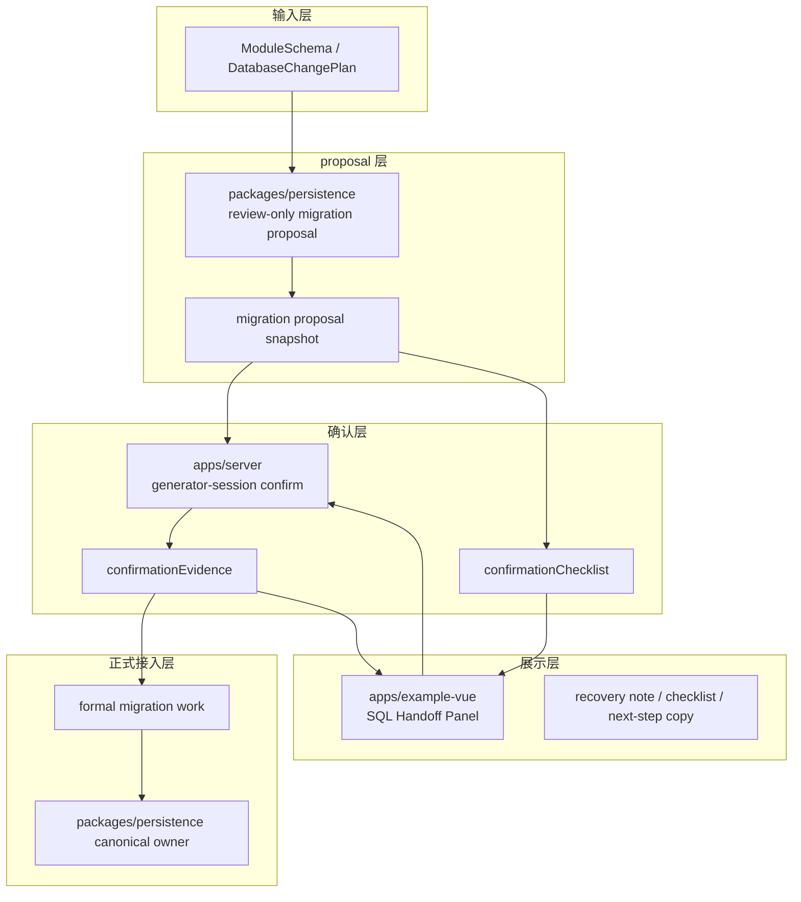

# 2026-05-03 Generator SQL Proposal Confirmation Handoff Spec

## 背景

当前 generator 自举主线已经打通：

- `packages/generator` 负责 schema -> preview / report / SQL preview
- `apps/server` 的 `generator-session` 负责 preview / review / confirm / apply 的运行时编排
- `packages/persistence` 负责 review-only migration proposal artifact
- `apps/example-vue` 负责展示与人工操作入口

现阶段真正还需要收口的，不是“有没有确认动作”，而是：

1. 确认动作的语义是否稳定
2. SQL proposal 到正式 migration 的人工接入边界是否明确
3. 发生恢复、自愈、归档时，确认人是否能一眼看懂当前事实

## 目标

把 `review-only SQL proposal -> human confirmation -> formal migration work` 定义成一条显式、可验证、可回放的接入链路。

## Canonical Owners

- `packages/persistence`
  - canonical owner: review-only migration proposal artifact
  - 负责输出 SQL draft、Drizzle snippet、风险标签、proposal snapshot
- `apps/server`
  - canonical owner: preview / review / confirm / apply 编排
  - 负责记录确认事实、回放报告、会话状态与审计
- `apps/example-vue`
  - canonical owner: 展示确认清单、确认前提醒、确认后状态提示
  - 不负责生成正式 migration 文件

## 不变量

1. `SQL preview` 仍然是 review-only，不等于正式 migration。
2. `confirmationChecklist` 只是确认前检查项，不是确认结果本身。
3. `confirm` 只表示“人工已确认当前 proposal 可以进入下一步”，不直接生成正式 migration 文件。
4. 正式 migration 的 owner 仍然在 `packages/persistence`，不是 `apps/example-vue`。
5. 若 snapshot 被重建或归档，确认界面必须保留这类 recovery 事实。

## 确认语义

`confirmPreview` 的语义固定为：

- 读当前 session 的 `sqlProposalHandoff`
- 读取或回放当前 `confirmationChecklist`
- 将当前确认人、确认时间、确认结果写回 session
- 把确认事实作为后续 apply / audit / replay 的依据

### 确认前提

只有在以下条件满足时才允许确认：

- `proposalStatus === ready`
- `confirmationChecklist` 非空
- current session 仍然对应同一个 report path
- 若存在 recovery 状态，UI 必须已展示该状态

### 确认后结果

确认完成后，session 应至少保留：

- `confirmedAt`
- `confirmedBy*`
- `confirmationEvidence.checklist`
- `confirmationEvidence.reportPath`
- `confirmationEvidence.snapshotPath`
- `confirmationEvidence.recoveryStatus`

## 交互分层

## 最小规则集

### 1. 什么时候可以确认

- proposal 是 ready
- checklist 已展示且可复制
- 目标 snapshot 已存在
- 若 snapshot 发生自愈，必须在摘要区可见恢复说明

### 2. 什么时候不能确认

- proposal unsupported
- checklist 为空
- 当前 session 已失效或 report path 不一致
- 需要先重新生成 snapshot / report

### 3. 确认后不能做什么

- 不能把 confirmation 误写成 migration 完成
- 不能跳过 persistence owner 直接落正式 migration 文件
- 不能把 review-only SQL preview 当成最终事实

## UI 呈现建议

`apps/example-vue` 的 generator workspace 至少应提供三层信息：

1. 摘要区：当前文件、当前 session、当前状态、recovery note
2. Handoff 区：SQL proposal、snapshot 路径、确认清单、目标路径
3. 操作区：确认 / 应用按钮与错误提示

## 验证方式

- 单测：确认语义、checklist 文案、recovery note 显示
- 集成测试：confirm 前后 session 状态变化
- 回放测试：同一 report path 的重复确认行为
- 端到端：ready -> confirm -> apply 的最小闭环

## 暂不决策项

- 是否引入更完整的 migration editor
- 是否支持多阶段确认流
- 是否把 checklist 拆成机器可执行规则
- 是否为 SQL proposal 追加更复杂的 diff 分类
