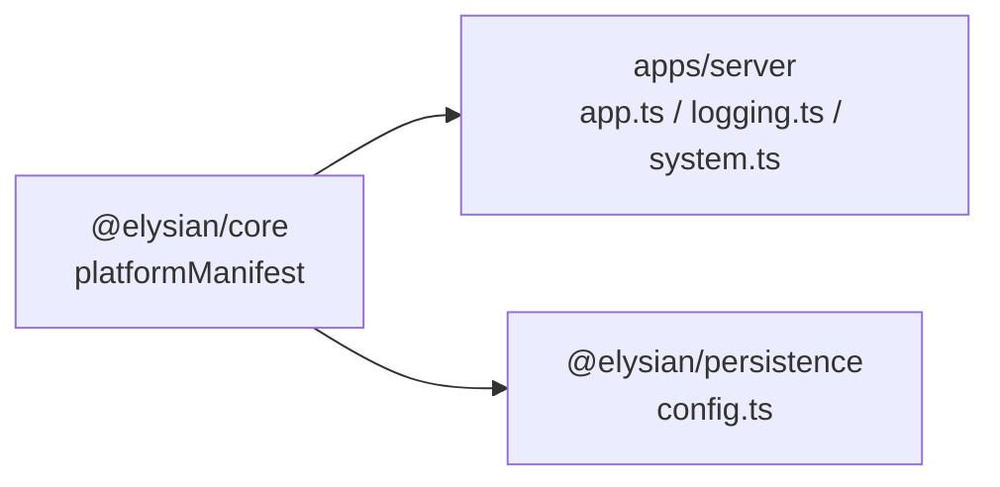
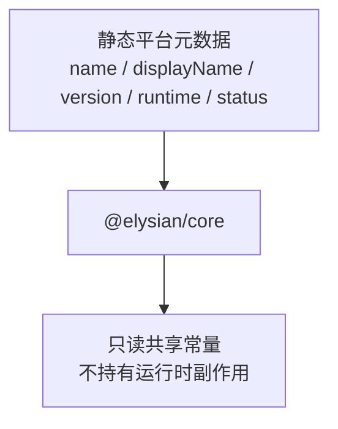

# `@elysian/core`

`@elysian/core` 目前是一个刻意保持极小的核心包。按当前代码事实，它只暴露平台 manifest，用来给 server 和 persistence 共享平台名、运行时状态等最基础元数据。

## 当前状态

- 状态：最小可用
- 真实导出面：`platformManifest`、`PlatformManifest`
- 当前消费者：`apps/server`、`packages/persistence`

## Owns

- 平台级基础 manifest
- 允许跨 package 复用、且不带业务语义的最小核心元数据

## Must Not Own

- 业务 schema
- 数据库访问
- HTTP、鉴权、日志语义
- 前端组件、页面协议、生成模板
- “暂时没地方放”的 shared utils

## Depends On

- 当前无 workspace 依赖
- 当前无第三方运行时依赖

## Real Export Surface

```ts
export const platformManifest
export type PlatformManifest
```

## Boundary View



## Input / Output Contract



## Key Flows

- `apps/server` 读取 `platformManifest`，用于应用装配、系统接口和日志上下文。
- `packages/persistence` 读取 `platformManifest.name`，在缺少 `DATABASE_URL` 时输出统一错误语义。
- 当前没有更高层工具、文件 helper 或路径 helper 落在这个包里，README 不把这些规划态 owner 写成已实现事实。

## With Apps

- `apps/server` 是当前直接 app 级消费者。
- 其他 apps 目前不直接依赖这个包。

## Validation

- 当前验证方式主要来自消费者编译链路：`apps/server` 与 `packages/persistence` 的类型和运行时导入。
- 仓库可用的上层验证仍是根命令，如 `bun run typecheck`、`bun run test`、`bun run check`。
- 本次未运行这些验证命令。
