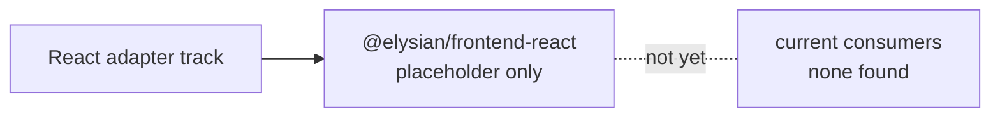
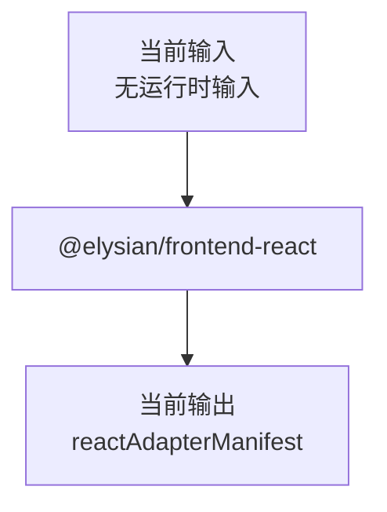

# `@elysian/frontend-react`

`@elysian/frontend-react` 当前仍是占位包。按代码事实，它只导出一个 `reactAdapterManifest`，用于标记 React 适配层这条轨道被保留，但尚未进入实现。

## 当前状态

- 状态：占位
- 真实导出面：`reactAdapterManifest`
- `reactAdapterManifest.status = "planned"`
- 当前未发现 app 或其他 package 对它的实际消费

## Owns

- React 适配层轨道的占位描述对象
- 对未来 React owner 的最小显式声明

## Must Not Own

- 任何已声称“可用”的 React 组件实现
- React 权限组件、导航、页面协议映射的事实实现
- 通用 schema、持久化、生成器模板

## Depends On

- `package.json` 当前声明依赖 `@elysian/schema`
- 但 `src/index.ts` 当前没有实际 import

## Real Export Surface

```ts
export const reactAdapterManifest = {
  framework: "react",
  status: "planned",
  focus: "admin shell, forms, tables, and route-level permission integration",
}
```

## Boundary View



## Input / Output Contract



## Key Flows

- 当前没有 CRUD 映射、权限 gate、导航构建、locale runtime 或 UI 组件导出。
- 这个包的实际意义是“保留 owner 名字与方向”，不是“已经提供 React 适配能力”。

## With Apps

- 当前未发现 `apps/*` 直接依赖这个包。
- 当前也未发现其他 `packages/*` 直接依赖这个包。

## Validation

- 当前未发现 package-local 测试文件。
- 现有验证主要是 workspace 级类型检查会确保它至少能被解析。
- 本次未运行这些验证命令。
