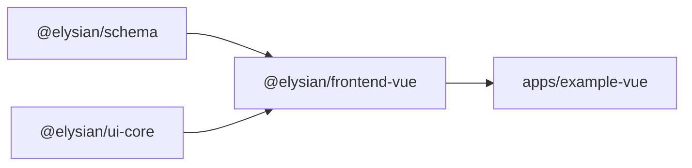
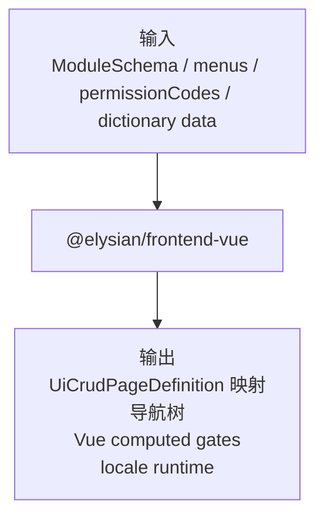
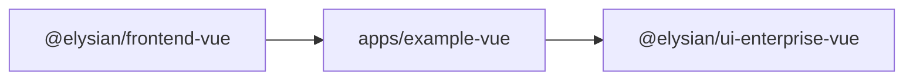

# `@elysian/frontend-vue`

`@elysian/frontend-vue` 不是企业组件库，而是 Vue 侧协议适配层。它把 `@elysian/schema` 和 `@elysian/ui-core` 的中立契约，映射成 Vue 可直接消费的 CRUD 页面定义、权限 gate、导航树和 locale runtime。

## 当前状态

- 状态：已被 `apps/example-vue` 真实消费
- 已实现预设：
  - `vueCustomPresetManifest.status = "prototype"`
- 仅保留目标描述、未在此包实现的预设：
  - `vueEnterprisePresetTarget.status = "planned"`

## Owns

- `ModuleSchema -> UiCrudPageDefinition` 的 Vue 侧映射
- Vue 权限 gate composable
- Vue 导航构建 helper
- 字典选项注入 helper
- Vue locale runtime
- Vue 预设清单描述对象

## Must Not Own

- 企业组件实现
- 视觉 token 和组件库绑定
- 后端鉴权规则本体
- 通用 schema 定义
- HTTP API client 的事实实现

说明：架构文档允许这里拥有 Vue 侧 API 封装，但按当前代码事实，这个包还没有实际导出 API client。

## Depends On

- `@elysian/schema`
- `@elysian/ui-core`
- `vue`

## Real Export Surface

代表性导出包括：

```ts
export const vueCustomPresetManifest
export const vueEnterprisePresetTarget
export const buildVueCustomCrudPage
export const getCrudPageDictionaryTypeCodes
export const buildCrudDictionaryOptionCatalog
export const applyCrudDictionaryOptions
export const buildVueNavigation
export const buildPermissionGates
export const usePermissions
export const createVueLocaleRuntime
export const provideVueLocaleRuntime
export const useVueLocaleRuntime
```

## Boundary View



## Input / Output Contract



## Key Flows

- `buildVueCustomCrudPage()` 把 `ModuleSchema` 映射成 `ui-core` CRUD 页面协议，供上层页面装配使用。
- `buildCrudDictionaryOptionCatalog()` 和 `applyCrudDictionaryOptions()` 负责把字典类型 / 字典项注入到查询字段和表单字段。
- `buildVueNavigation()` 基于 `ui-core` 的菜单过滤与树构建逻辑，生成 Vue 侧导航树。
- `usePermissions()` 把权限码列表封装为 Vue 响应式 gate。
- locale runtime 负责基础多语言上下文注入，但不持有 app 级文案资产本身。

## With Apps



- `apps/example-vue` 当前使用这个包来做导航、权限和 locale 装配。
- 真正的企业组件渲染在 `@elysian/ui-enterprise-vue`，不在这个包里。
- README 不把 `vueEnterprisePresetTarget` 误写成“已经在本包落地”。

## Validation

- 包内已有 `packages/frontend-vue/src/index.test.ts`。
- 实际消费链路存在于 `apps/example-vue`。
- 仓库可用上层验证包括 `bun run typecheck`、`bun run build:vue`、`bun run test`。
- 本次未运行这些验证命令。
