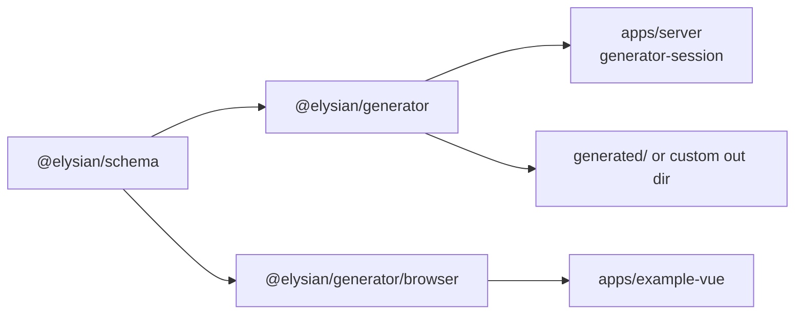
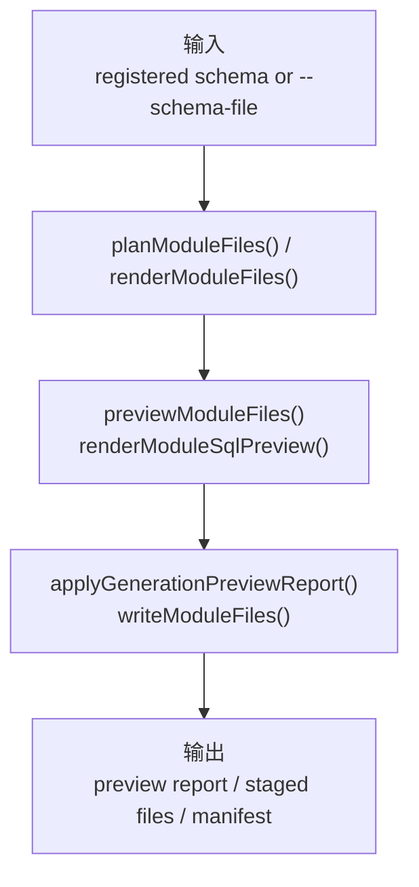
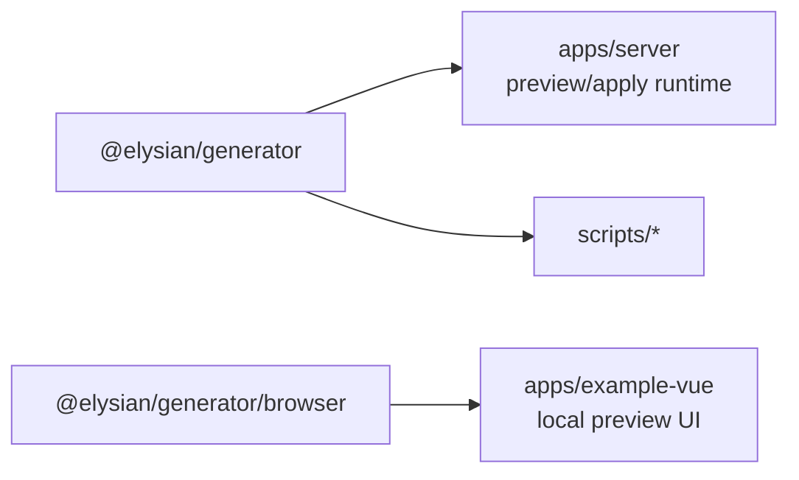

# `@elysian/generator`

`@elysian/generator` 负责把 `@elysian/schema` 的结构化输入转成可审阅的文件计划、渲染结果、preview report、安全写入结果，以及 review-only SQL preview。它是生成流程 owner，但不是正式 migration owner，也不是业务运行时 owner。

## 当前状态

- 状态：已被 server、脚本和示例前端真实消费
- 根导出：Node / Bun 侧生成、preview、apply 能力
- 子路径导出：`@elysian/generator/browser`，提供浏览器可消费的纯规划能力

## Owns

- 已注册 schema 的查找入口
- 文件计划与模板渲染
- preview report 结构
- 冲突策略与安全写入
- review-only SQL preview
- `ModuleSchema -> DatabaseChangePlan` 的中立数据库变更规划

## Must Not Own

- 正式数据库 migration 执行权
- 业务规则判断
- server 运行时鉴权
- 前端页面状态管理
- 直接替代人工代码审查

## Depends On

- `@elysian/schema`
- Bun / Node 内建文件系统能力

说明：架构上允许它依赖 `@elysian/core`，但按当前代码事实，包内并未直接导入 `@elysian/core`。

## Real Export Surface

根导出：

```ts
export { buildModuleDatabaseChangePlan } from "./database-change-plan"
export { planModuleFiles, renderModuleFiles } from "./core"
export { getRegisteredSchema, listRegisteredSchemaNames } from "./schemas"
export {
  DEFAULT_GENERATION_TARGET,
  DEFAULT_MERGE_STRATEGY,
  DEFAULT_OUTPUT_DIR,
  listTargetPresets,
  resolveTargetPresetOutputDir,
} from "./conventions"
export {
  buildGenerationPreviewReport,
  previewModuleFiles,
  writeGenerationPreviewReport,
} from "./preview"
export { renderModuleSqlPreview } from "./sql-preview"
export {
  applyGenerationPreviewReport,
  PreviewReportApplyError,
  writeModuleFiles,
} from "./write"
```

浏览器子路径导出：

```ts
export { buildModuleDatabaseChangePlan } from "./database-change-plan"
export { planModuleFiles, renderModuleFiles } from "./core"
export { getRegisteredSchema, listRegisteredSchemaNames } from "./schemas"
export { renderModuleSqlPreview } from "./sql-preview"
```

## Boundary View



## Input / Output Contract



## Key Flows

- CLI 入口 `src/cli.ts` 负责读取注册 schema 或外部 schema 文件，并调用规划、preview、写入链路。
- `previewModuleFiles()` 生成结构化 preview report，供 server 侧 `generator-session` 和示例前端展示。
- `write.ts` 负责冲突策略、漂移校验、原子写入和 manifest 落盘，是“安全 apply”边界所在。
- `@elysian/generator/browser` 只暴露纯计算能力，故可被 `apps/example-vue` 直接消费；它不包含文件系统写入接口。

## With Apps



- `apps/server` 当前通过 `generator-session` 模块消费 preview / apply 能力。
- `apps/example-vue` 当前通过 `@elysian/generator/browser` 做浏览器本地预览辅助。
- `scripts/*` 直接消费主包导出，执行 generator regression / safe apply 回归。

## Validation

- 包内已有 `index.test.ts`、`database-change-plan.test.ts`、`preview.test.ts`、`write.test.ts`、`cli-args.test.ts`。
- 仓库级验证还包括 `bun run e2e:generator:matrix`、`bun run e2e:generator:cli`、`bun run e2e:generator:safe-apply`。
- 本次未运行这些验证命令。
