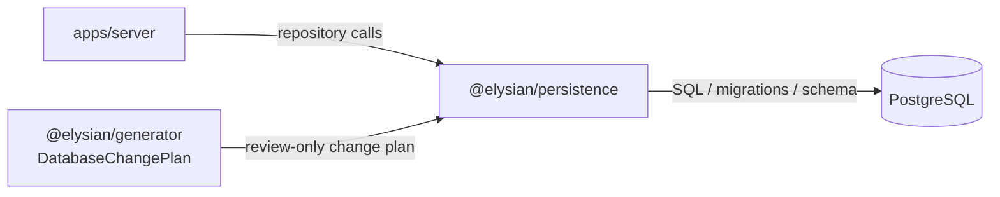
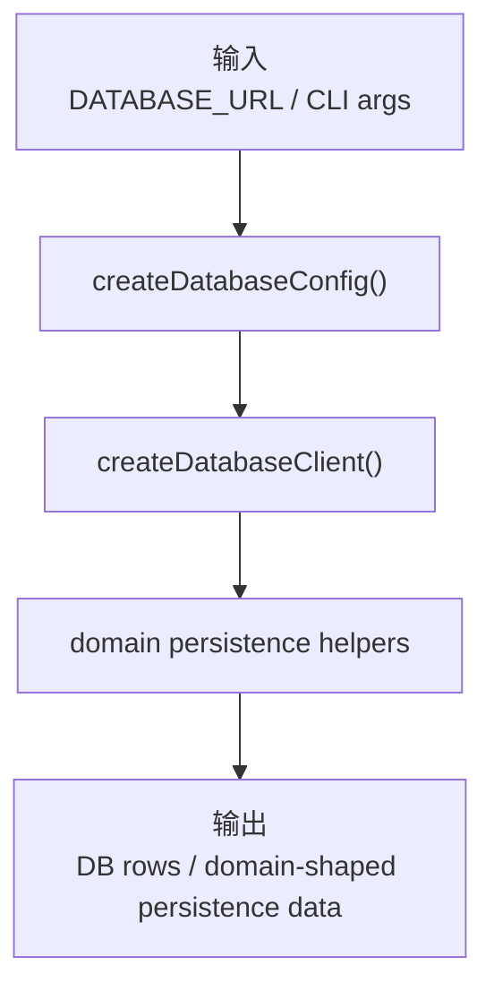
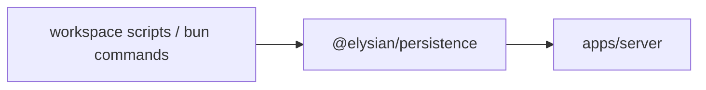

# `@elysian/persistence`

`@elysian/persistence` 是当前仓库的数据库 canonical owner。它同时持有数据库配置、Bun SQL + Drizzle client、关系型 schema、迁移目录、seed / tenant init CLI，以及各业务域的 persistence helper。

## 当前状态

- 状态：已被 `apps/server` 主线真实使用
- 数据库基线：`PostgreSQL`
- ORM / client：`drizzle-orm` + `postgres` + Bun runtime
- 当前主要消费者：`apps/server`

## Owns

- `DATABASE_URL` 驱动的数据库配置解析
- Bun SQL / Drizzle client 创建
- `src/schema/*` 下的关系型 schema
- `drizzle/*.sql` 迁移产物
- customer / auth / tenant / dictionary / setting / workflow 等 persistence helper
- tenant context 持久化边界
- `db:seed`、`db:tenant:init` 这类数据初始化入口
- `DatabaseChangePlan` 到 migration proposal 的 review-only 转换

## Must Not Own

- HTTP 路由与请求生命周期
- 鉴权规则判定本身
- 文件二进制存储适配器
- 页面 DSL、前端状态、组件实现
- generator 的模板渲染逻辑

## Depends On

- `@elysian/core`
- `drizzle-orm`
- `postgres`
- 开发期工具：`drizzle-kit`、`@electric-sql/pglite`

## Real Export Surface

根导出按职责大致分为：

- DB bootstrapping：`createDatabaseConfig`、`createDatabaseClient`
- migration proposal：`buildMigrationProposalFromChangePlan`
- tenant / data scope：tenant context 与 data access helpers
- 业务 persistence helpers：customer、auth、user、role、menu、department、dictionary、setting、file、notification、workflow、post、generator-session
- seed / tenant init 相关能力
- 原始 Drizzle schema table / row type 导出

## Boundary View

## Input / Output Contract

## Key Flows

- `apps/server` 的 repository 层通过这个包调用持久化 helper，而不是自行 new DB client。
- `src/config.ts` 统一校验 `DATABASE_URL`，避免 server 和 CLI 重复发明数据库入口。
- `src/client.ts` 统一创建 Drizzle client，保持 DB 接入点单一。
- `src/seed.ts` 和 `src/tenant-init.ts` 负责默认数据与租户初始化，这些能力仍属于 persistence owner，而不是 server owner。
- `buildMigrationProposalFromChangePlan()` 只做 review-only proposal，不把正式 migration owner 从 persistence 外移。

## With Apps

- `apps/server` 是当前唯一明确的 app 级运行时消费者。
- 仓库脚本和 CLI 通过 `bun run db:migrate`、`bun run db:seed`、`bun run tenant:init` 等命令消费这个包。
- 前端 packages 不应直接依赖这个包。

## Validation

- 包内存在多组测试：如 `drizzle-migrations.test.ts`、`seed.test.ts`、`tenant-init.test.ts`、`workflow.test.ts`、`generator-session.test.ts`。
- 更高层验证包括 `bun run db:migrate`、`bun run e2e:tenant:full`、`bun run check`。
- 本次未运行这些验证命令。
