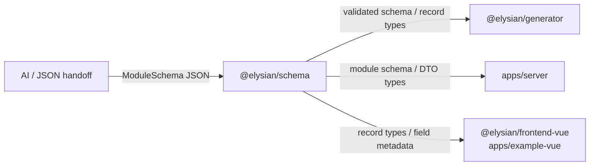
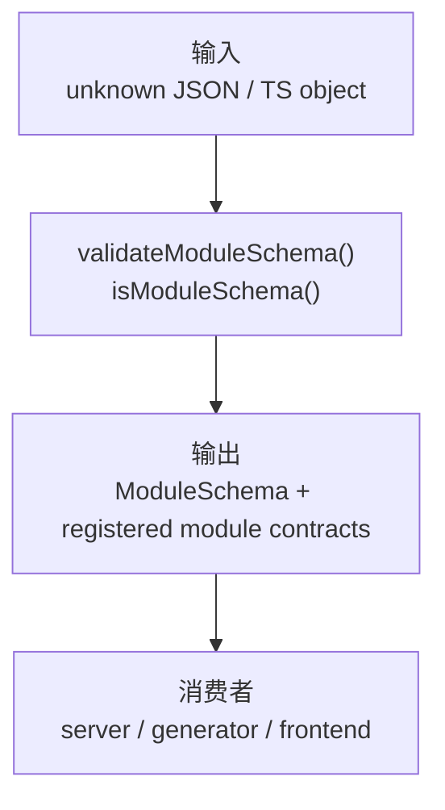
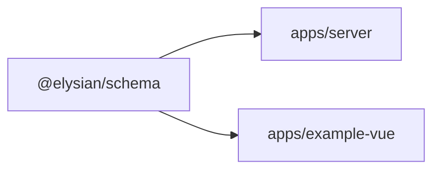

# `@elysian/schema`

`@elysian/schema` 是结构化契约 owner。它把模块 schema、字段元数据、运行时校验和一组已注册模块类型集中在同一个框架中立包里，供 server、generator 和前端共同消费。

## 当前状态

- 状态：已被主线真实消费
- 真实导出面：
  - `moduleSchemaVersion`
  - `moduleFieldKinds`
  - `validateModuleSchema`
  - `isModuleSchema`
  - 多个已注册模块 schema 与记录类型
  - workflow 条件表达式解析与 definition draft 校验
- 当前消费者：`apps/server`、`packages/generator`、`packages/frontend-vue`、`apps/example-vue`

## Owns

- `ModuleSchema`、`ModuleField`、`ModuleFieldOption` 契约
- schema runtime 校验规则
- 已注册模块的结构化定义与记录类型
- workflow 结构化定义层的中立契约

## Must Not Own

- 数据库 client、Drizzle schema、迁移
- HTTP 路由、鉴权实现
- Vue / React 组件实现
- 代码生成模板和文件写入策略

## Depends On

- 当前无 workspace 依赖
- 当前无第三方运行时依赖

## Real Export Surface

当前根导出分两层：

1. 通用 schema 基础能力
2. 已注册模块的 schema / record type

代表性导出包括：

```ts
export const moduleSchemaVersion
export const moduleFieldKinds
export const validateModuleSchema
export const isModuleSchema
export type ModuleSchema
export type ModuleField
export type ModuleFieldOption
export { customerModuleSchema, userModuleSchema, roleModuleSchema, ... }
export {
  workflowModuleSchema,
  parseWorkflowConditionExpression,
  validateWorkflowDefinitionDraft,
  ...
}
```

## Boundary View



## Input / Output Contract



## Key Flows

- `apps/server` 直接导入模块 schema，例如 `customerModuleSchema`、`workflowModuleSchema`，把它们作为模块边界契约的一部分。
- `packages/generator` 以 `ModuleSchema` 为输入，生成文件计划、SQL preview 和 schema artifact。
- `packages/frontend-vue` 读取 `ModuleSchema` 字段元数据，把它映射成 `ui-core` 的 CRUD 页面协议。
- `apps/example-vue` 直接消费若干 record type，例如 workflow、notification、tenant 等前端数据形状。

## With Apps



- `apps/server` 是 schema 的主要运行时消费者。
- `apps/example-vue` 主要消费类型和少量模块记录语义，不拥有 schema 本身。

## Validation

- 包内已有 `packages/schema/src/index.test.ts`。
- 更高层验证来自 `packages/generator`、`apps/server`、`apps/example-vue` 的真实类型消费。
- 仓库可用命令是 `bun run typecheck`、`bun run test`、`bun run check`。
- 本次未运行这些验证命令。
