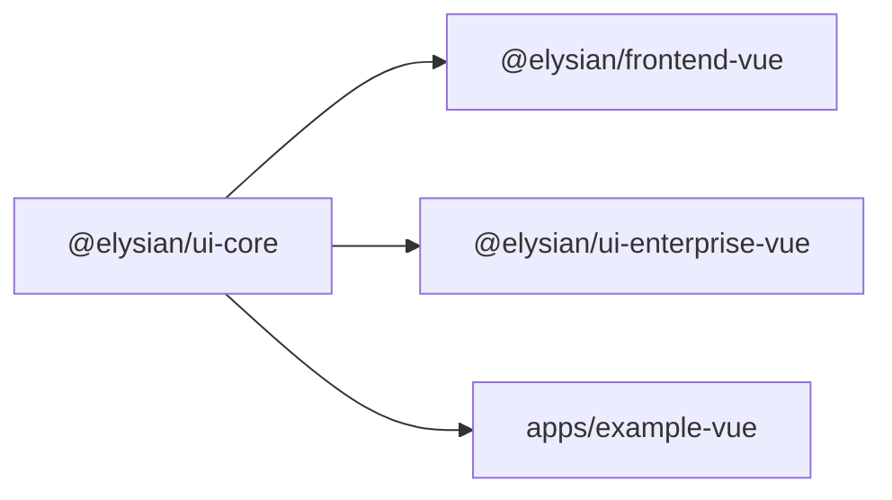
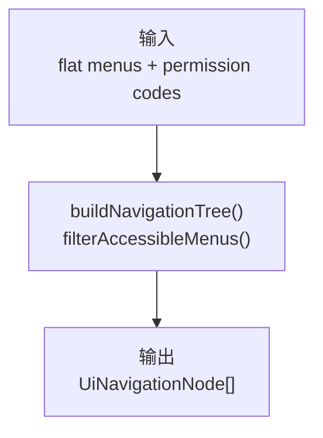
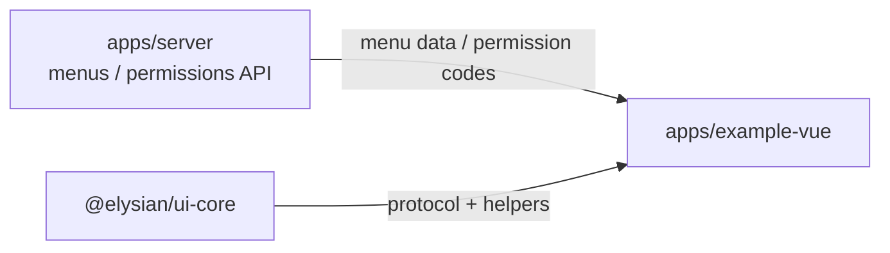

# `@elysian/ui-core`

`@elysian/ui-core` 是框架中立的 UI 协议层。它不渲染组件，只定义预设清单、菜单、CRUD 页面、查询字段、表单字段等中立契约，并提供最小的导航树与权限过滤逻辑。

## 当前状态

- 状态：已被多个 Vue 侧包和示例应用真实消费
- 真实导出面：UI 协议类型 + 3 个基础 helper
- 当前消费者：`@elysian/frontend-vue`、`@elysian/ui-enterprise-vue`、`apps/example-vue`

## Owns

- `UiPresetManifest`
- `UiMenuItem` / `UiNavigationNode`
- `UiCrudPageDefinition` 及相关字段类型
- `buildNavigationTree()`
- `hasPermission()`
- `filterAccessibleMenus()`

## Must Not Own

- Vue / React 组件实现
- 第三方组件库视觉细节
- 业务 schema、数据库访问、HTTP 调用
- app 级工作区状态和页面文案

## Depends On

- 当前无 workspace 依赖
- 当前无第三方运行时依赖

## Real Export Surface

```ts
export type UiPresetKind
export interface UiPresetManifest
export interface UiMenuItem
export interface UiNavigationNode
export interface UiTableColumn
export interface UiSelectOption
export interface UiQueryField
export interface UiFormField
export interface UiPageAction
export interface UiCrudPageDefinition
export const buildNavigationTree
export const hasPermission
export const filterAccessibleMenus
```

## Boundary View



## Input / Output Contract



## Key Flows

- `frontend-vue` 依赖这个包的 UI 协议类型，再把 schema 映射成页面定义。
- `ui-enterprise-vue` 依赖这个包的 `UiCrudPageDefinition`，再转成真正的组件 props / emits 契约。
- `apps/example-vue` 直接消费菜单与导航节点类型，保持 app 不去重定义第二套 UI 协议。

## With Apps



- app 从 server 拿菜单和权限数据。
- `ui-core` 提供“如何组织这些数据”的中立协议，而不是 app 的最终渲染。

## Validation

- 包内已有 `packages/ui-core/src/index.test.ts`。
- `frontend-vue`、`ui-enterprise-vue`、`apps/example-vue` 都在真实消费这些类型和 helper。
- 本次未运行 `bun run test`、`bun run typecheck` 或 `bun run build:vue`。
