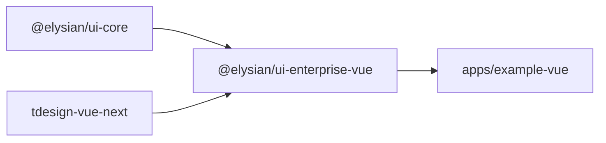
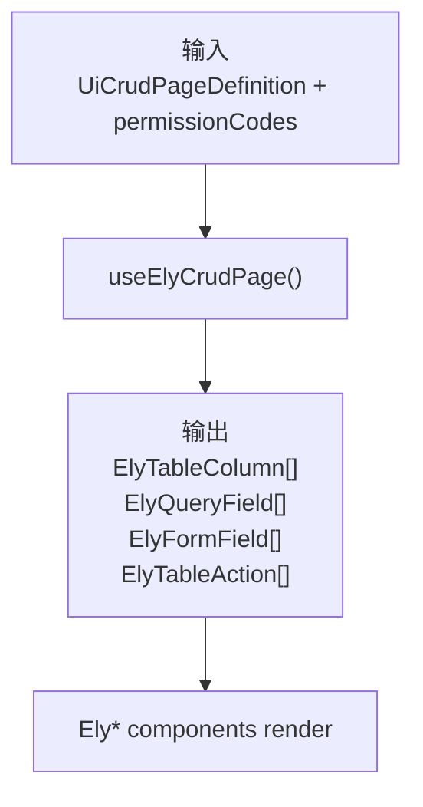
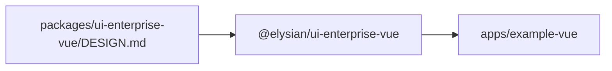

# `@elysian/ui-enterprise-vue`

`@elysian/ui-enterprise-vue` 是 Vue 企业预设的真实渲染层。它基于 `tdesign-vue-next` 提供企业后台壳层、表格、查询栏、表单、CRUD 工作区和预览骨架，并把 `@elysian/ui-core` 的中立协议转成可直接渲染的 Vue 组件契约。

## 当前状态

- 状态：`prototype`
- 设计底座：`tdesign-vue-next`
- 视觉规则来源：`packages/ui-enterprise-vue/DESIGN.md`
- 当前主要消费者：`apps/example-vue`

## Owns

- `ElyShell`、`ElyTable`、`ElyQueryBar`、`ElyForm`、`ElyCrudWorkspace`、`ElyPreviewSkeleton`、`ElyNavNodes`
- 企业预设组件契约 `contracts.ts`
- `useElyCrudPage()` 这类从中立页面定义到企业组件契约的映射
- 企业预设 manifest 与 foundation 描述
- TDesign 运行时绑定与全局样式引入

## Must Not Own

- `UiCrudPageDefinition` 等中立协议的 canonical owner
- `ModuleSchema` 定义与校验
- app 级业务状态、API client、页面编排
- 与企业预设无关的通用共享视觉系统

## Depends On

- `@elysian/ui-core`
- `vue`
- `tdesign-vue-next`

## Real Export Surface

代表性导出包括：

```ts
export { default as ElyForm } from "./components/ElyForm.vue"
export { default as ElyCrudWorkspace } from "./components/ElyCrudWorkspace.vue"
export { default as ElyNavNodes } from "./components/ElyNavNodes.vue"
export { default as ElyPreviewSkeleton } from "./components/ElyPreviewSkeleton.vue"
export { default as ElyQueryBar } from "./components/ElyQueryBar.vue"
export { default as ElyShell } from "./components/ElyShell.vue"
export { default as ElyTable } from "./components/ElyTable.vue"
export { resolveElyShellCopy }
export const vueEnterprisePresetManifest
export const vueEnterprisePresetFoundation
export const useElyCrudPage
export type { ...component contracts }
```

## Boundary View



## Input / Output Contract



## Key Flows

- `src/index.ts` 在包入口直接引入 `tdesign-vue-next/es/style/index.css`，说明这个包确实拥有企业预设的运行时样式接入。
- `useElyCrudPage()` 把 `ui-core` 的中立页面定义转换为企业组件层的表格列、查询字段、表单字段和动作按钮。
- `contracts.ts` 定义 `Ely*` 组件族共享的 props / emits 契约，是这个包自己的 UI 边界。
- `vueEnterprisePresetManifest.status = "prototype"`，所以 README 只把它写成“已存在的原型预设”，不夸大为完全稳定的设计系统。

## With Apps



- `apps/example-vue` 当前是这个包的主验证场。
- 包级 `DESIGN.md` 约束共享企业预设的视觉语言；app 可以补充，但不应反向改写这里的设计 owner。

## Validation

- 包内已有 `packages/ui-enterprise-vue/src/index.test.ts`。
- 更高层真实消费发生在 `apps/example-vue` 的多个 workspace 和页面组件中。
- 仓库可用上层验证包括 `bun run build:vue`、`bun run test`、`bun run typecheck`。
- 本次未运行这些验证命令。
